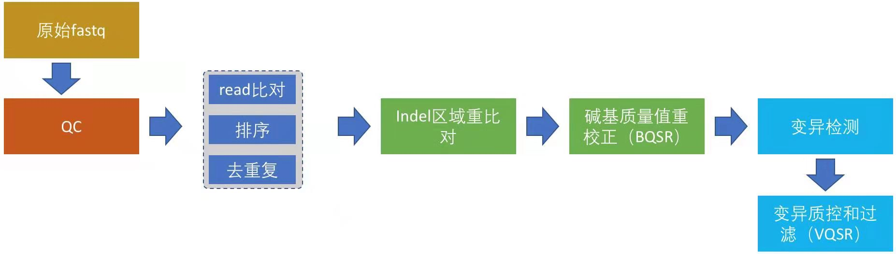
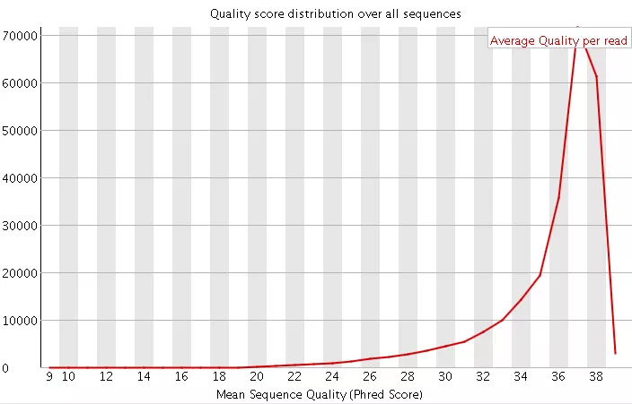
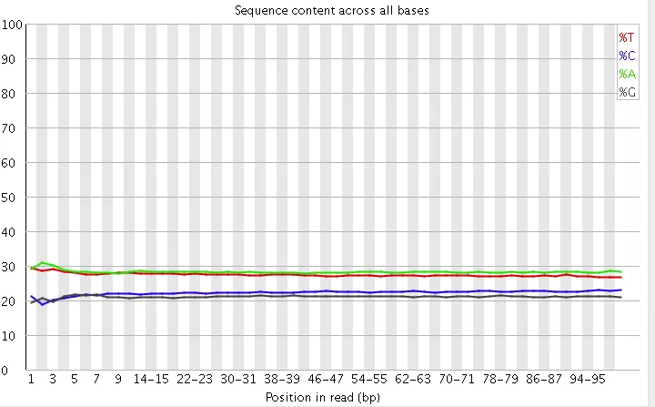
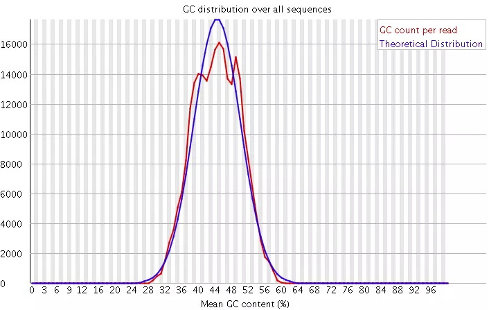
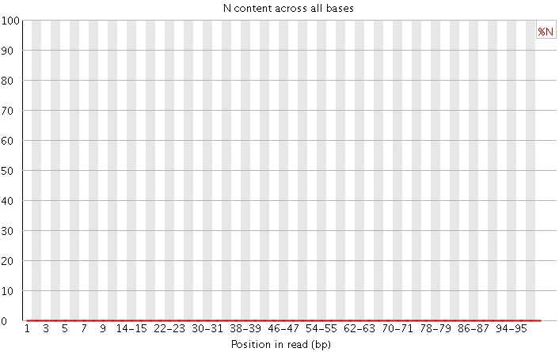
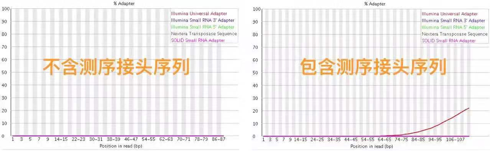
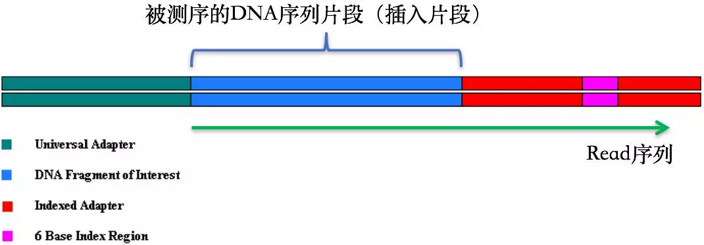

# 全基因组测序分析 chapter 03

## 数据质量控制

-   1.原始测序数据的质控
-   read比对，排序和去除重复序列
-   3.Indel区域重（“重新”的“重”）比对
-   碱基质量值重校正
-   5.变异检测
-   变异结果质控和过滤

## 认识测序技术--数据质控的意义
    illumina为首的基本上使用的是`边合成边测序`的技术。
    碱基的合成依靠的是化学反应，这使得碱基链可以延伸
    但是，注意DNA酶的合成效率会不断下降的...

    导致后面的错误率会越来越高。

    当然测序仪本身可能不稳定，然后就带来质量的波动

### 分析数据之前搞清楚
- 原始数据是通过哪种测序平台产生的，它们的错误率分布是怎么样的，是否有一定的偏向性和局限性，是否会显著受GC含量的影响等；
- 评估它们有可能影响哪些方面的分析；

---
    那么问题来了，测序深度是多少来着？
    如何认识原始的测序数据呢

-   read各个位置的碱基质量值分布
    -   用那个ASCII码计算read的质量值和碱基的测序错误率。
    -   比如用的最广的FastQC，它是一个java程序，能够用于给出测序报告中QC报告，报告中会同时给出上述
        -   几个方面的数据图
        -   FastQC并不单独查看具体一条read中的碱基的质量值，而是将Fastq文件中所有的read都综合在一起分析
        -   看碱基质量值足矣。。
-   碱基的总体质量值分布
-   read各个位置上碱基分布比例，目的是为了分析碱基的分离程度
-   GC含量分布
-   read各位置的N含量
-   read是否还包含测序的接头序列
-   read重复率，这个是实验的扩增过程所引入的

-   (1)碱基总体质量分布值
    -   在第2节 FASTA和FASTQ里面我也提到了关于Q20和Q30的比例是我们衡量测序质量的一个重要指标。这其实也是从这里提现，一般来说，对于二代测序，最好是达到Q20的碱基要在95%以上（最差不低于90%），Q30要求大于85%（最差也不要低于80%。
   
-   (2)read 各个位置上碱基的比例分布
    -   
    -   这个是为了分析碱基的分离程度。何为碱基分离？我们知道AT配对，CG配对，假如测序过程是比较随机的话（随机意味着好），那么在每个位置上A和T比例应该差不多，C和G的比例也应该差不多，如上图所示，两者之间即使有偏差也不应该太大，最好平均在1%以内，如果过高，除非有合理的原因，比如某些特定的捕获测序所致。
-   (3)GC含量分布图
    -   
    -   GC含量指的是G和C这两中碱基占总碱基的比例。二代测序平台或多或少都存在一定的测序偏向性，我们可以通过查看这个值来协助判断测序过程是否足够随机。对于人类来说，我们基因组的GC含量一般在40%左右。因此，如果发现GC含量的图谱明显偏离这个值那么说明测序过程存在较高的序列偏向性，结果就是基因组中某些特定区域被反复测序的几率高于平均水平，除了覆盖度会有偏离之后，将会影响下游的变异检测和CNV分析。
-   (4) N含量分布图
    -   
    -   N在测序数据中一般是不应该出现的，如果出现则意味着，测序的光学信号无法被清晰分辨，如果这种情况多的话，往往意味着测序系统或者测序试剂的错误。
-   (5) 接头序列
    -   
    - 在第1节 测序技术里面我们提到了在测序之前需要构建测序文库，测序接头就是在这个时候加上的，其目的一方面是为了能够结合到flowcell上，另一方面是当有多个样本同时测序的时候能够利用接头信息进行区分。当测序read的长度大于被测序的DNA片段【注】时，就会在read的末尾测到这些接头序列（如下图）。一般的WGS测序是不会测到这些接头序列的，因为构建WGS测序的文库序列（插入片段）都比较长，约几百bp，而read的测序长度都在100bp-150bp这个范围。不过在进行一些RNA测序的时候，由于它们的序列本来就比较短很多只有几十bp长（特别是miRNA），那么就很容易会出现read测通的现象，这个时候就会在read的末尾测到这些接头序列。
    【注意】 这些DNA片段也常被我们称之为“插入”片段
    - 

### FastQC的使用
    FastQC的安装非常简单，可以通过网页搜索或者直接去主页bioinformatics.babraham.ac.uk/pro/etcs/fastqc上下载最新的版本

    命令行安装也行

    命令也比较简单，这里唯一值得注意的就是-o参数，用于指定FastQC报告的输出目录，
    这个目录需要事先创建好，否则就默认目录

### 切除测序接头序列和read的低质量序列
    可以自己编写工具进行个性化的过滤

    当然可以完全使用工具去除低质量碱基和接头序列：
        比如:SOAPnuke、cutadapt、untrimmomatic等等不下十个，
        其中比较好用的是Trimmomatic(也是一个java程序)，sickle、seqtk
    
#### Trimmomatic
    的好处在于，它不但可以用来切除illumina测序平台的接头序列，
    而且还可以去除我们自己指定的特定接头序列
    也可以过滤read末尾的低质量序列,
    注意其原理

-   官网下载(http://www.usadellab.org)
---
    接头序列可以从illumina平台上寻找啥的

    后面的关于Trimmer信息，规定了很多切除接头序列和低质量序列的细节

    此外，另一个值得注意的地方是，Trimmomatic的报错给出的提示信息都比较难以定位错误问题（如下图），但这往往都只是参数用没设置正确所致。

#### Trimmonmatic、SOAPnuke、sickle和seqtk的比较
    SOAPnuke的安装比较麻烦
    就是多个软件绘图，比较最终的结果呗。
