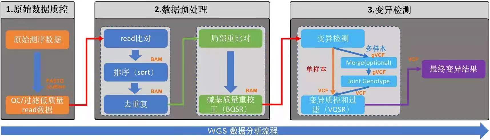
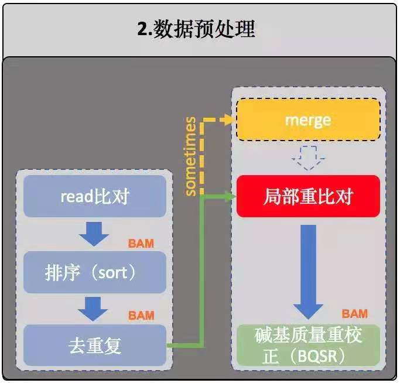
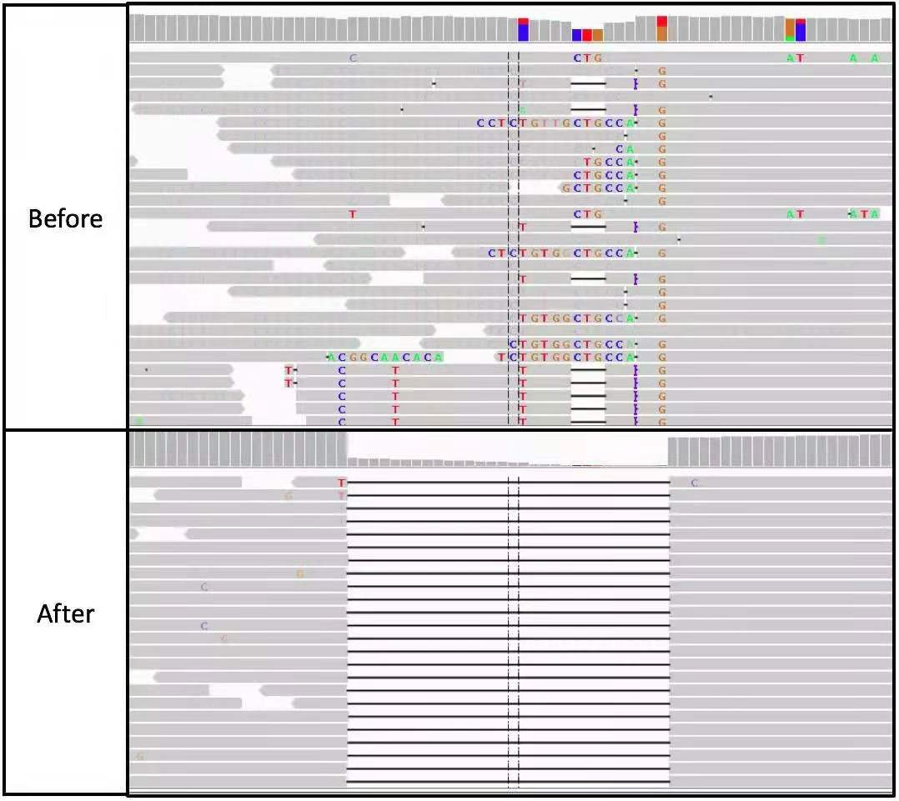
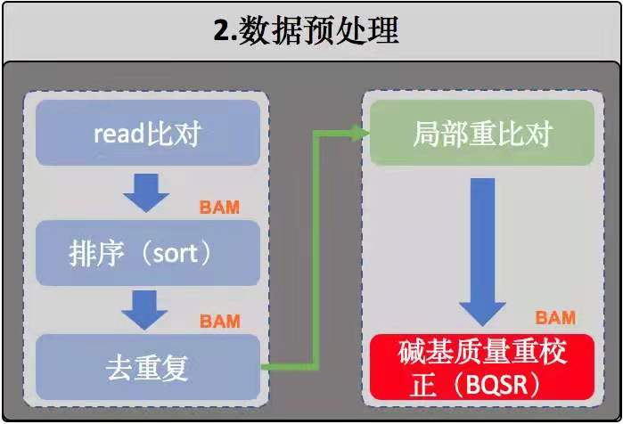
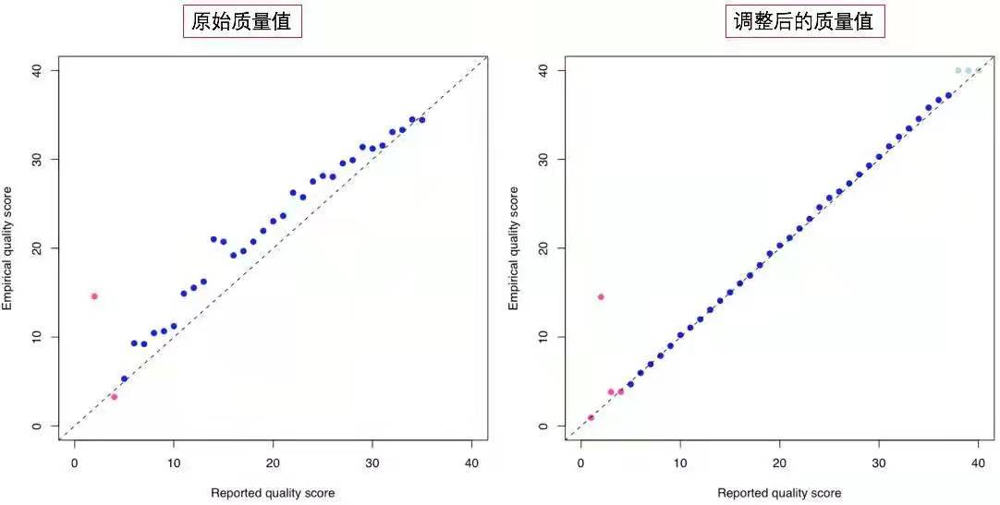
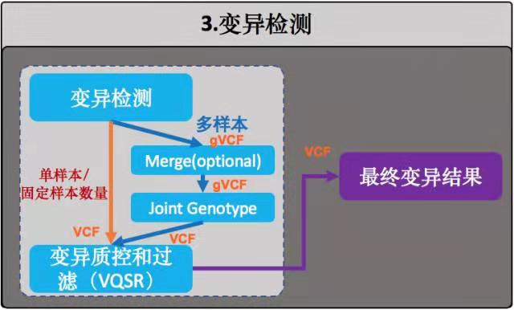

# 全基因组测序分析 chapter 04
    流程的具体形式其实是次要的，WGS本质上只是一个技术手段
    重要的是，明白自己的问题是什么，预期是什么，再选择合适的技术

   

-   原始数据质量控制
-   数据预处理
-   变异检测

## 0.准备阶段
    github上有开源的软件
    BWA  最权威，使用最广的NGS软件，目前已经更新到0.7.16版本

    Samtools(https://broadinstitute.github.io.picard)   是一个专门用于处理对比数据的工具，由BWA的作者(Ih3)编写

    Picard  由组学研究中心-Broad研究所开发的一款强大的NGS数据处理工具，功能方面和Samtools
    有些重叠，但更多的是互补，java编写的，直接下载最新的.jar包就行

    GATK   同样是Broad研究所开发的，是目前最广的基因变异检测工具

## 1.原始数据质量控制
    略

## 2.数据预处理
    我们已经知道NGS测序下来的短序列(read)存储于FASTQ文件中。
    虽然之前它们都来源于有序基因组，但经过DNA建库和测序后，
    文件中不同的read之间的前后顺序关系就已经完全丢失了。
    因此，FASTQ文件中紧挨着的两条read之间没有任何的位置关系，
    它们都是随机来自于原本基因组中某个位置的短序列而已。

    需要把这一大堆短序列撸顺，一个一个去跟该物种的参考基因组比肩，
    找到每一条read在基因组上的位置，然后按顺序排列好，这个过程就称之为 测序数据的对比

    参考基因组，该物种的标准参考物

### 流程的搭建
    参考基因组流程的搭建
    参考序列进行Burrows Wheeler变换(wiki:块排序压缩)
    以便能够在序列对比时快速的搜索和定位

#### 参考基因组的索引
    这其实是在为参考序列进行Burrows Wheeler变换(wiki：块排序压缩)

    双末端测序(Pair-End Sequencing,PE测序)
    单末端测序(Single End Sequencing,SE测序)
    这里肯定需要纠结一下子的
    
### 排序
   

    这一步我们也是使用samtools完成的

### 去除重复序列
    准确来说是去除PCR重复序列

-   DNA在打断的那一步会发生一些损失，主要表现是会引发一些碱基发生颠倒变换，带来变异
    -   PCR扩增会放大这个差异
-   PCR反应过程中也会带来新的碱基错误。
-   对于真实的变异，PCR反应可能对包含某一个碱基的DNA模板扩增的更加剧烈(PCR Bias)
    -   如果反应体系是对含有reference allele的模板扩增偏向强烈，那么变异碱基的信息会变小，从而导致假阴
----
    PCR对真实的变异检测和个体的基因型判断都有不好的影响。
    GATK、Samtools、Platpus等利用贝叶斯原理的变异检测算法都是认为所用的序列数据都不是重复序列。

    所以一般采用PCR-Free的测序方案

### 局部重对比
       
    局部重对比的目的是：将BWA对比过程中所发现有潜在序列插入或者序列删除(insertion 和 deletion)
    ,简称Indel；的区域进行重新校正。

    根本原因来自于：参考基因组的序列特点和BWA这类对比算法本身，
    注意这里不是针对BWA，而是针对所有的这类对比算法，包括bowtie等。
    这类在全局搜索最优匹配的算法在存在Indel的区域及其附近的对比情况往往不是很准确。

    另外一个重要的原因在这些对比算法中，对碱基错配和开gap的容忍度是不同的。

    所以，另外一种算法大名鼎鼎的Smith-Waterman算法，它非常适合这类场景，
    可以极其有效第降低对全局对比结果的校正和调整，最大程度地降低

----
    序列冲对比之前和之后的结果
    灰色      -----> read
    空白黑线 -------> deletion
    有颜色的碱基指的是错配碱基
     

    变异检测必须是使用GATK,而且必须使用GATK的HaplotypeCaller模块，
    仅当这个时候才可以减少这个Indel局部重对比的步骤。

### 重新校正碱基质量值(BQSR)
 
    WGS分析中，变异检测是一个极度依赖测序碱基质量值的步骤。
    因为这个质量值是衡量我们测序出来的这个碱基到底有多正确的重要（甚至是唯一）指标

    它来自于测序图像的base calling。因此，基本上是由测序仪和测序系统来决定的。

    调整这个碱基质量值的方式
    BQSR(Base Quality Score Recalibration)这个步骤就是为此而存在的。
    它是通过机器学习的方法构建测序碱基的错误率模型，然后对这些碱基的质量值进行相应的调整。
    
---
    横轴（Reported quality score) 测序结果在Base calling之后出来的质量值，
    也就是FASTQ文件中看到的那些。
    纵轴(Empirical quality score) 代表的是"真实情况的质量值"

    试想一下，如果我们在看到某一个碱基报告的质量值是20时，那么它的预期错误率是1%，反过来想，就等于是说如果有100个质量值都是20的碱基，那么从统计上讲它们中将只有1个是错的！做了这个等效变换之后，我们的问题就可以转变成为寻找错误碱基的数量了。

    这时问题就简单多了。我们知道人与人之间的差异其实是很小的，那么在一个群体中发现的已知变异，在某个人身上也很可能是同样存在的。因此，这个时候我们可以对比对结果进行直接分析，首先排除掉所有的已知变异位点，然后计算每个（报告出来的）质量值下面有多少个碱基在比对之后与参考基因组上的碱基是不同的，这些不同碱基就被我们认为是错误的碱基，它们的数目比例反映的就是真实的碱基错误率，换算成Phred score（Phred score的定义可以参考第2节 FASTA和FASTQ的相关内容）之后，就是纵轴的Empirical quality score了。

    注意，因为BQSR实际上是为了（尽可能）校正测序过程中的系统性错误，因此，在执行的时候是按照不同的测序lane或者测序文库来进行的，这个时候@RG信息（BWA比对时所设置的）就显得很重要了，算法就是通过@RG中的ID来识别各个独立的测序过程，这也是我开始强调其重要性的原因。

## 3.变异检测
     
    WGS数据分析流程的一个目标---获得样本准确的集合。
    这里检测的内容一般会包括：SNP、Indel、CNV和SV等

    这里使用GATK HaplotypeCaller模块对样本中的变异进行检测，
    它也是目前最适合用于对二倍体基因组进行变异(SNP+Indel)检测的算法。
## 变异检测质控和过滤(VQSR)
    构建GMM模型对好和坏的变异的区分，从而实现对变异的质控。

    

