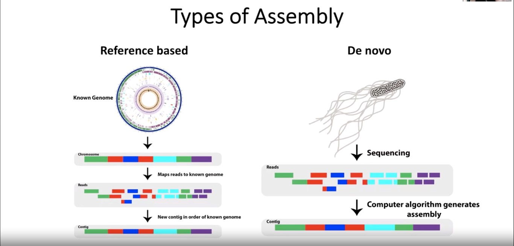
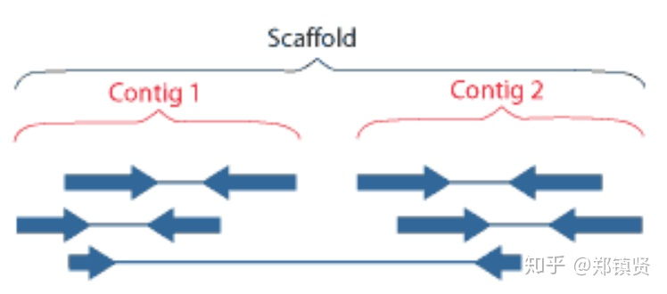
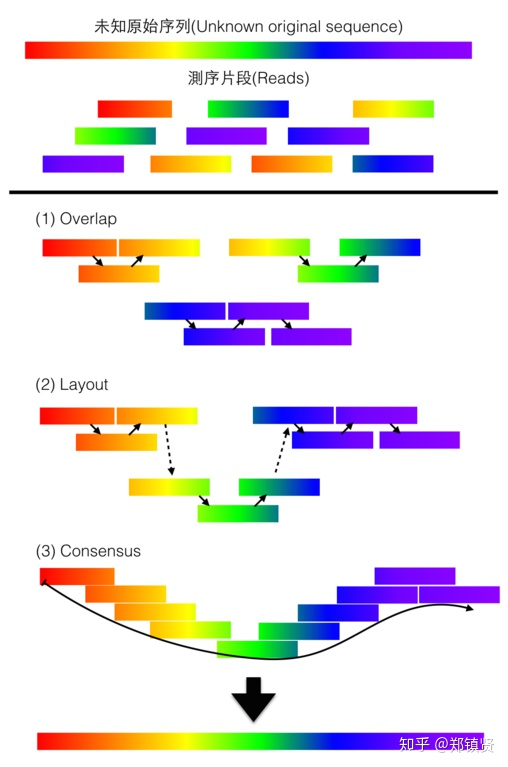
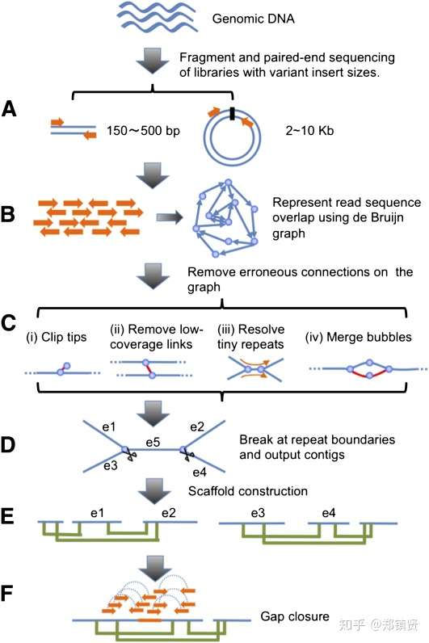
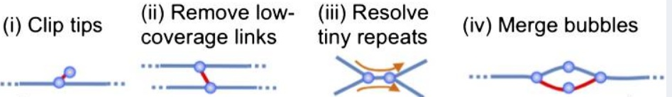
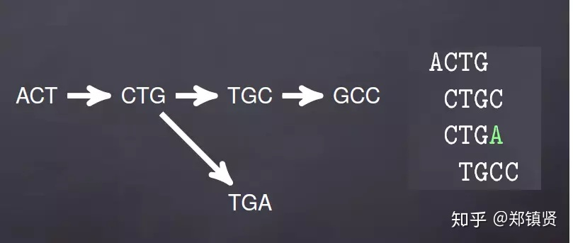
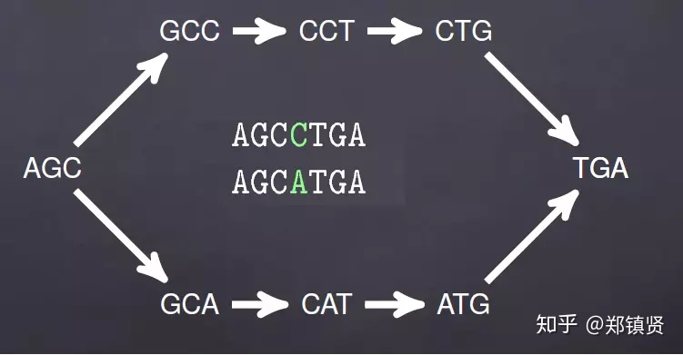
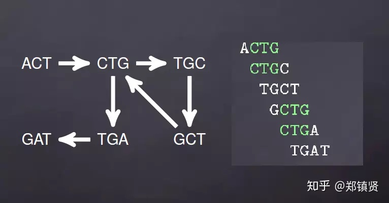

### genome Assembly
    基因组组装(Genome assembly)是生物信息学领域的核心问题，基因组组装就是把序列测序产生的读取片段reads经过序列拼接组装，生成基因组的碱基序列。

    宏观来说，基因组组装可以分为从头组装(De novo assembly) 和映射比对组装(mapping assembly), 从头组装是指不需要依靠任何已知的基因组信息，反过来，映射比对组装就是需要把测序序列和参考基因组来比对，找到序列的对应位置再进行组装，
 

    目前基因组组装一般有基于OLC(Overlap-Layout-Consensus, 先重叠后扩展)和基于De Brujin Graph(DBG)两种组装算法，基于OLC的组装方法适合长序列组装，运行依赖的数据结构需要消耗大量的内存，且运行速度比较慢，错误率高，而DBG组装方法内存消耗相对较低，运算速度快，且准确率高。目前主流的基因组装算法都是基于后者改进设计的。

    由于目前组装技术的限制和实际情况的复杂性，最终组装得到的序列与真实基因组序列之间仍可能存在差异，甚至只能得到若干条无法进一步连接起来的序列。对组装效果的评价主要依由于据组装序列的连续性、完整性和准确性。连续性要求组装得到的（多条）序列长度尽可能长；完整性要求组装序列的总长度占基因组序列长度的比例尽可能大；准确性要求组装序列与真实序列尽可能符合。
 

#### **基本概念**
    在开始之前，有几个名词需要说明下：

**`reads`**：就是我们测序产生的短读序列，通常一代和三代的reads读长在几千到几万bp之间，二代的相对较短，平均是几十到几百bp。

**`contig`**：中文叫做重叠群，就是不同reads之间的overlap交叠区，拼接成的序列就是contig
    
**`scaffold`**:这是比contig还要长的序列，获得contig之后还需要构建paired-end或者mate-pair库，从而获得一定片段的两端序列，这些序列可以确定contig的顺序关系和位置关系，最后contig按照一定顺序和方向组成scaffold，其中形成scaffold过程中还需要填补contig之间的空缺。

### **基于OLC算法**
    OLC组装算法主要这么对一代和三代测序序列因为他们的reads读长相对较长。OLC算法的整体步骤可以分为三步：
 
-    Overlap：对所有reads进行两两比对，找到片段间的重叠信息，一般在比对之前会将reads做下索引，减少计算量。这里需要设定最小重叠长度，如果两个read的最小重叠长度低于一定阈值，那么可以认为两段序列顺序性较差。

-    Layout：根据得到的重叠信息将存在的重叠片段建立一种组合关系，形成重叠群，即Contig。Contig进一步排列，生成多个较长的scaffold.

-    根据构成Contig的片段的原始质量数据，在重叠群中寻找一条质量最重的序列路径，并获得与路径对应的序列，即Consensus。通过Consensus的多序列比对算法，就可以获得最终的基因组序列。

#### 基于DBG算法
    基于DBG基因组装算法原理图如下：
 
    详细的步骤如下：

**序列k-mer化**：对需要测序的片段等大小拆分，即将reads 逐个碱基切分为长度为K的子序列。例如我们的K取3，那么序列ACGTCGA就会被拆分成5个子序列分别是：ACG, CGT, GTC, TCC, CGA。

**de Brujin图构建**：de Brujin图是一种有向图，我们将k-mers得到的子序列作为图的节点，如果两个节点有 K-1个共同重叠子集，就把两个节点连接在一起，这样一定程度上已经能够展现出序列的顺序信息了，例如：

从上面的两个序列得到的de Brujin图可以知道，红色部分为高频的子序列，而绿色的为相对低频的子序列。

1. 图结构简化：这里主要简化结构的以下方面:
2. 去除低频和低覆盖率的k-mer
3. 将小的重复对解开，让每个节点的入度和出度都为1
4. 将相似性较高的k-mers合并，也就是bubbles合并成单链

 

网上有个小哥总结这几个还是不错的

1. 测序错误产生的分支：

2. SNP导致的bubble结构：

1. reads序列重复导致的bubble：

**contigs拆分**：通过read的配对末端（pair-end）和环化配对（mate-pair）信息去除一些环结构，最后把一些无法合并的分叉结构再次拆分成多个contigs：

**scaffold构建**：这个过程和OLC的比较类似，也是通过contig两端的pair的序列信息，将多个contig连接成scaffold。同时将contig之间的GAP填充，补充方式是通过已经组装的contigs之间的覆盖关系来补充，形成多个没有空缺的scaffold。

最终组装：最终是把多个scaffold组装成无GAP的基因组序列。

注：这一部分主要靠自己理解和参考其他文献所写，如有不正之处，敬请批评指教！

欢迎大家关注ta的知乎专栏：[从零开始生物信息学](https://zhuanlan.zhihu.com/c_1060579529482948608)

