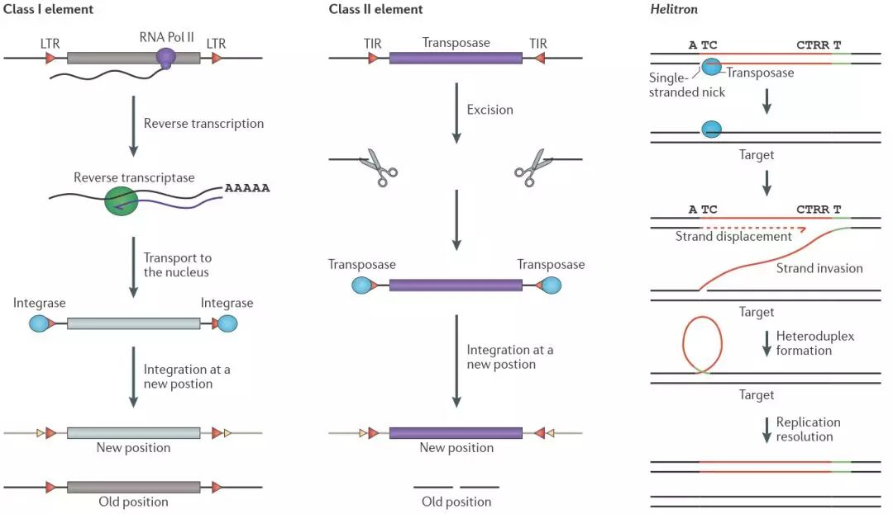
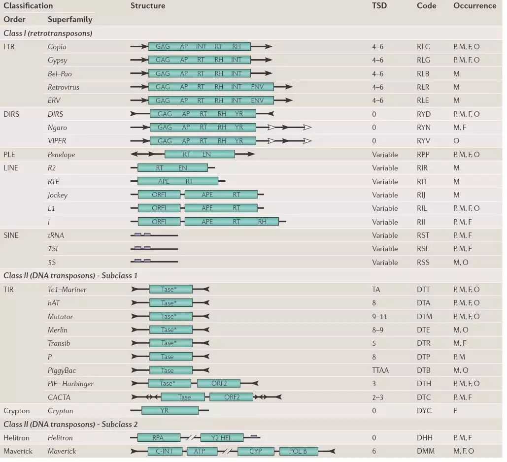
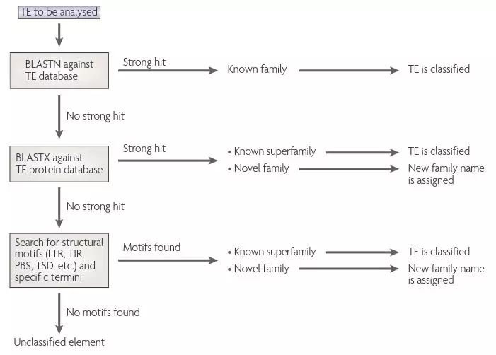
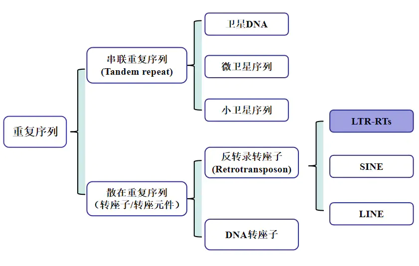
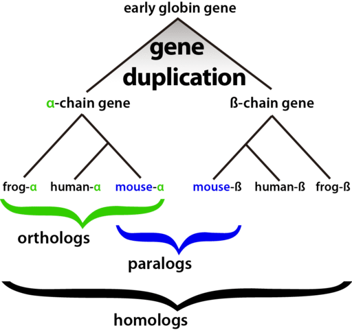

# Transposable elements（转座子)
*A transposable element (TE, transposon, or jumping gene) is a **`DNA sequence`** that can change its position within a genome, sometimes creating or **`reversing mutations`** and **`altering the cell's genetic identity`** and **genome size**.
Transposition often results in duplication of the same genetic material. Barbara McClintock's discovery of them earned her a Nobel Prize in 1983.*

## classification
Generally speaking, we can classfy the transpons into ***3 groups***.
Two of the most abundant retrotransposon families in eukaryotes are
-   `LINE-1 (L1)`
-   `Bovine-B (BovB) `

the other is :
-   `Helitron`

转座子作为几种可动遗传因子之一，还可以根据其是`复制-粘贴`还是`剪切-粘贴`分为`I型转座子`和`II型转座子`两类[2]。

Class-I型转座子

-   `反转录转座子`
    I型转座子转座`中间体`是`RNA`。I型转座子又被称为逆元件（Retro element）。该型转座子会先被转录为RNA，然后该RNA被逆转录，再次成为DNA，才被插入到目标位点中。

Class-II型转座子

-   相比起I型转座子的“`复制后粘贴`”，II型转座子的转座行为就是“`剪切后粘贴`”。II型`转座中间体`是`DNA`，其实就是它本身。因此II型转座子又被称为不复制转座子。这类型的转座子在结构上有其特点。首先是转座子序列的两端，是两段正向重复序列（direct repeat，简称dR），与它们接壤的是反向重复序列（invert repeat，简为iR），就是所谓的“回文”序列。然后才是中间的插入序列（Insert sequence，简为IS）。

### Retrotransposon
>反转录转座子（Retrotransposon）是由`RNA介导`转座的转座子的元件，在`结构`和`复制`上与反转录病毒（retrovirus）类似，只是没有病毒感染必需的env基因。它通过`转录`合成mRNA，再`逆转录`合成新的元件整合到基因组中完成转座，每转座1次拷贝数就会增加1份，可以增强自己的基因组。
>因此，它是许多真核生物中数量最大的一类可活动遗传成分。在植物中特别丰富，它们是`核DNA`的一个主要组成部分。在玉米的基因组49-78％是反转录转座子，而在小麦中包含约90％的基因组重复序列和68％的转座子。在哺乳动物中，几乎有一半的基因组（45％至48％）包含转座子或残余转座子。人类基因组有大约42％反转录转座子，而DNA转座子约占2-3％。

>根据***两端侧翼***有无`LTR（long terminal repeat）`，可将反转座子进一步划分为**LTR反转座子**和**非LTR反转座子**。LTR 是一段长末端重复序列，其长度从100bp到5kb不等，携带转录起始和终止的信号，位于 LTR 反转座子两端侧翼，调节 mRNA 媒介的形成。另外，还可根据能否“自给自足”，将反转座子分为`自主型反转座子`和`非自主型反转座子`。自主型反转座子编码了所有转座必须的蛋白；而非自主型反转座子缺少一些转座必须的蛋白，需要在自主型反转座子的帮助下才能顺利完成转座。植物中数量最多的非自主型反转座子叫做 short interspersed nuclear elements (SINEs)。

反转录转座子与反座子 (retroposon) 较为相似，然而两者的主要区别为反转录转座子具有反转录酶，而反座子没有。

#### Long terminal repeat elements (LTR), which include retroposons
长末端重复序列（LTR）：反转录病毒的基因组的两端各有一个长末端重复序列(5’—LTR和3’—LTR)，不编码蛋白质，但含有启动子，增强子等调控元件，病毒基因组内的LTR可转移到细胞原癌基因邻近处，使这些原癌基因在LTR强启动子和增强子的作用下被激活，将正常细胞转化为癌细胞。

原文链接：https://blog.csdn.net/tanzuozhev/article/details/80958785

入门必看 | 深度解析长末端重复反转录转座子（LTR-RTs）
>https://www.jianshu.com/p/a93cdbc36339 
## 分析
>自然界中，转座子是含有转座酶基因的离散 DNA 片段，侧翼是含有转座酶结合位点的末端反向重复序列（TIR）。转座酶与 TIR 结合并从一个位置"切割"转座子并将其"粘贴"到新的位点（称为转座）。

### 实例

    
     
    

    
LTR 的分类        P: 植物  M: 后生动物  F :真菌  O：其他

    

<!--  -->

<!-- 
LTR 的分类        P: 植物  M: 后生动物  F :真菌  O：其他
 -->

### 聚类分析
> OrthoMCL及orthofinder 两种软件进行聚类分析
### 共线性分析

对于亲缘关系较近的物种一般使用核苷酸序列来进行分析，如果在核苷酸水平不能呈现出很好的共线性的话，还可以换用编码基因水平的共线性（更适用于真核种）
除了全基因组共线性外，常见的还有功能基因簇的局部共线性分析
>https://www.jianshu.com/p/da5922df19d1
>http://www.cxyzjd.com/article/sinat_38163598/73180998

使用wgd进行全基因组复制分析,不知道是啥子，先留着呗。

>https://zhuanlan.zhihu.com/p/123875815

### 基因组Repeat Sequence
>Identifying repeats and transposable elements in sequenced genomes: how to find your way through the dense forest of programs

### 转座子分类的依据介绍
由于转座子的多样性和复杂性，许多研究转座子的实验室都有各自的命名规则，没有一个统一的标准，导致转座子的名称比较混乱。2007年 Nature Reviews Genetics发表了题为
**《A unified classification system for eukaryotic transposable elements 》**
的文章，制定了一套统一的真核生物转座子命名规则。文章中将转座子划分为六个等级 `class`, `subclass`, `order`, `superfamily`, `family` and `subfamily`，这六个等级层层嵌套，根据每个等级的特点将转座子进行分类和命名。另外，他们还提出了一套转座子命名的流程和方法，才使人们有了一套可靠的标准，能够更加便捷的对转座子进行命名和注释。

生物细胞中的DNA序列里面包含许多重复序列(repeated sequence):
根据重复次数可以分为，中度重复序列（10^2~10^5）和高度重复序列。
根据来源和分布特点又可以分为串联重复和分散重复。

<!-- 比较啰嗦的 -->
<!-- 
·高度重复序列
重复次数>10^5次。卫星DNA、小卫星DNA和微卫星DNA按照重复次数属于高度重复序列，按照分布特点属于串联重复序列。

·中度重复序列
重复次数为10^2~10^5次。在小鼠中约占20%。如rRNA基因、tRNA基因和某些蛋白质（如组蛋白、肌动蛋白、角蛋白等）的基因。

·单拷贝序列·
就是在整个基因组中独有的一段序列，没有与它相似的重复片段。它占到哺乳动物核酸含量的50%~60%。

·轻度重复序列
是指重复2~10次的一些序列，例如tRNA基因和一些组蛋白基因；
-->

串联重复和散置重复序列的区别在于**重复的部分是否`相邻分布`**，相邻就是串联重复，不相邻就是散置重复。
如：ATGATGATGATG可以看作是关于`ATG`的串接重复；`ATGXATGXXATG`可以看作关于ATG的散置重复。两个主要类型又进一步划分为不同的子类型。

-   `串联重复`（Tandem repeat）
    -   卫星DNA（Satellite DNA）
    -   小卫星序列（Minisatellite）
    -   微卫星（Microsatellite）
-   `散置重复` （Interspersed repeat）
    -   短散落配置（short interspersed nuclear element；缩写SINE）
    -   长散落配置（long interspersed nuclear element；缩写LINE）
  
> from wiki

>https://zhuanlan.zhihu.com/p/183952007

>https://www.jianshu.com/p/a93cdbc36339

病毒 自身的转座子有哪些。。
1.自己构建原核生物数据库
2.转座酶
3.。。
4.寻找最长字符串儿,寻找重复出现的字符串儿。

### 转座子相关的数据库

>TREP `http://botserv2.uzh.ch/kelldata/trep-db/index.html`

>Dfam `https://dfam.org/`

>repbase `http://www.girinst.org/repbase/`

> P-MITE
一个植物特有的数据库，其中MITErepdb主要包含共有序列信息而MITEdb主要用于注释41种植物基因组中的各个微型倒置重复转座元件（miniature inverted repeat TE, MITE）。

>RiTE
是特别用于水稻及其相关物种基因组中重复元件研究的数据库，这个数据库中包含水稻基因组中全部转座元件的序列，共有序列以及单个转座子在参考基因组中的插入信息。

>MASiVEdb
数据库包含和RiTE差不多的信息，只是MASiVEdb包含更多的植物物种的转座子注释信息。

还有一些数据库是对那些插入到基因组上各基因的编码区的转座元件做汇总，包括TranspoGene, HESAS, 以及LINE FUSION GENES。

### 直系同源（orthology）和旁系同源（paralogy）

**`Orthologs`** 和 **`Paralogs`** 是同源序列的两种类型。**`Orthologs`** 描述在不同物种中来自于共同祖先的基因。**`Orthologs`** 基因可能有相同的功能，也可能没有。**`Paralogs`**描述在同一物种内由于基因复制而分离的同源基因。

***`Orthologs`*** 通常译作直系同源、直向同源、垂直同源。**`Paralogs`** 通常译作旁系同源、并系同源、横向同源。

[Xenology is the scientific study of extraterrestrial life. Derived from the Greek xenos, which as a substantive has the meaning "stranger, wanderer, refugee" and as an adjective "foreign, alien, strange, unusual."][1]

>Orthologs and Paralogs are two types of homologous sequences. Orthology describes genes in different species that derive from a common ancestor. Orthologous genes may or may not have the same function.Paralogy describes homologous genes within a single species that diverged by gene duplication.

>NCBI的Glossary中对paralog的定义是： A paralog is one of a set of homologous genes that have diverged from each other as a consequence of gene duplication. For example, the mouse a-globin andb-globin genes are paralogs. The relationship between mouse a-globin and chick b-globin is also considered paralogous (see the figure).

>NCBI的Glossary中对ortholog的定义是： Orthology describes genes in different species that derive from a single ancestral gene in the last common ancestor of the respective species.

>http://www.sciencedirect.com/science/article/pii/S0168952502027932

待会儿再看吧。

-   References: 

[1]: Henry George Liddell, Robert Scott, A Greek-English Lexicon, new (ninth) edition, with a supplement, Clarendon Press, Oxford, 1968.

[2] Lisch, D. (2013). How important are transposons for plant evolution?. Nature Reviews Genetics, 14(1), 49.

[3] Wicker, T., Sabot, F., Hua-Van, A., Bennetzen, J. L., Capy, P., Chalhoub, B., ... & Paux, E. (2007). A unified classification system for eukaryotic transposable elements. Nature Reviews Genetics, 8(12), 973.

[4] 彭珍, 徐珍珍, 刘静, & 杜建厂. (2015). 高等植物 helitron 转座子的研究进展. 西北植物学报, 35(12), 2558-2566.

[5] 武泽峰, 于慧云, & 范三红. (2015). 大麦基因组中 Helitron 转座元件的计算预测. 麦类作物学报, 35(9), 1183-1189.

高等植物helitron转座子的研究进展
>https://www.jianshu.com/p/

转入了病毒外壳蛋白基因和病毒的复制酶基因的植物 就具有了抗病毒的能力
>植物抗病毒基因工程

基因组序列对比...
>Pango谱系??
>https://zhuanlan.zhihu.com/p/121740252

