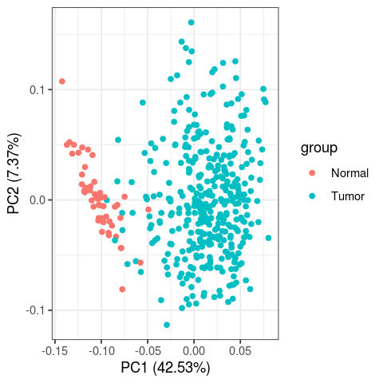
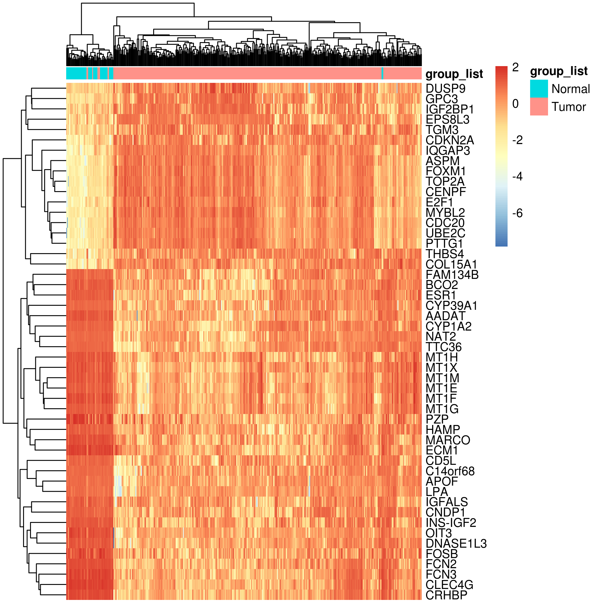
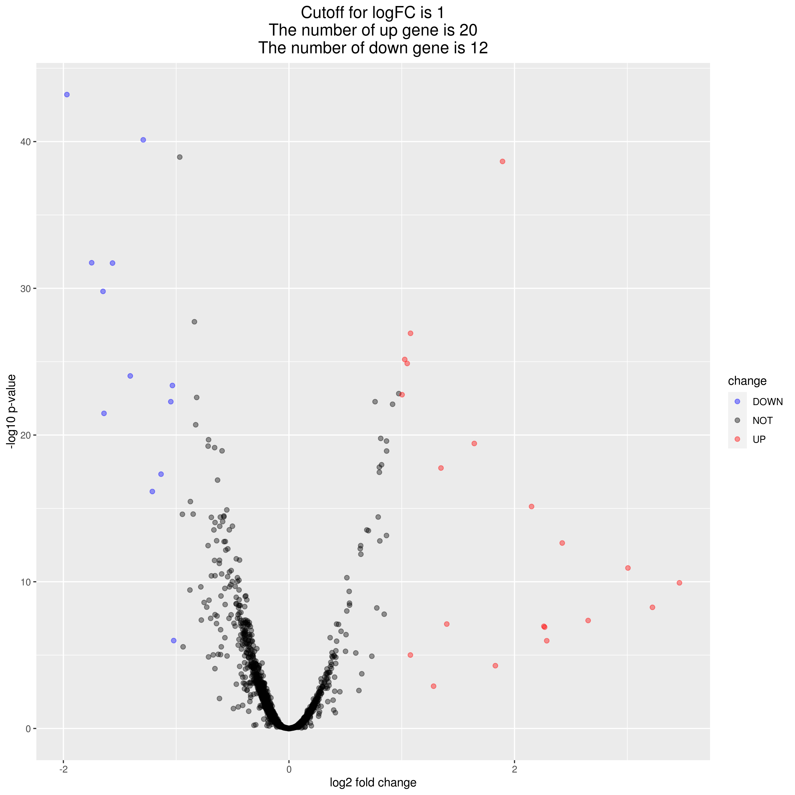

# 面试题
## 要求：
以中文报告形式呈现分析结果（说明文字——图标），另外需要附代码

## 思路
平时做的是植物的，对应动物的数据接触的比较少。
首先，有个大概的认识[TCGA系列5-UCSC Xena网站的简单使用和数据下载-哔哩哔哩]()
>[TCGA系列5-UCSC Xena网站的简单使用和数据下载-哔哩哔哩](https://b23.tv/QXwE4oH)
-   如何确定TCGA-DD-AA3A-01编码含义

```txt
简而言之，编码机构BRS（Biospeciman Core Resource）根据来源机构（Tissue Source Site，TSS）和捐献者（Participation），给予编号TCGA-02 和 TCGA-02-0001，根据组织类型（Sample）如癌组织、正常组织等，编为TCGA-02-0001-01（01-09为癌组织，10-14为正常组织，组织类型编码详见https://gdc.cancer.gov/resources-tcga-users/tcga-code-tables/sample-type-codes）。同一种组织的标本又会被分装进不同容器（Vial），同一容器内又可分为多个小份（Portion），进一步编为 TCGA-02-0001-01B和TCGA-02-0001-01B-02。样品送至检测机构后，制备成不同的分析物（Analyte）检测，用不同字母编码，例如D表示DNA，R表示RNA。同一份分析物在检测过程中被加到检测板的某一加样孔中，分别编号 TCGA-02-0001-01B-02D-0182和TCGA-02-0001-01B-02D-0182-06。

```

>[组织类型编码](https://gdc.cancer.gov/resources-tcga-users/tcga-code-tables/sample-type-codes)
>[TCGA条码](https://zhuanlan.zhihu.com/p/539346572)
-   临床数据如何确定
其他的大概涉及到梳理统计，选择什么工具
-   生产环境
实验室设备
>[online R clod](https://posit.cloud)
-   数据下载来源
>[dataset: gene expression RNAseq - IlluminaHiSeq](https://xenabrowser.net/datapages/?dataset=TCGA.LIHC.sampleMap%2FHiSeqV2&host=https%3A%2F%2Ftcga.xenahubs.net&removeHub=http%3A%2F%2F127.0.0.1%3A7222)
>[phenotype](https://xenabrowser.net/datapages/?cohort=TCGA%20Liver%20Cancer%20(LIHC)&removeHub=https%3A%2F%2Fxena.treehouse.gi.ucsc.edu%3A443)

### 试题：
1.从UCSC Xena数据库TCGA 肝癌转录组数据及临床信息
Transcriptome data and clinical information of hepatocellular carcinoma
```bash
1  wget -c  https://tcga-xena-hub.s3.us-east-1.amazonaws.com/download/TCGA.LIHC.sampleMap%2FLIHC_clinicalMatrix
2  wget -c https://tcga-xena-hub.s3.us-east-1.amazonaws.com/download/TCGA.LIHC.sampleMap%2FHiSeqV2.gz 
4  wget -c https://tcga-xena-hub.s3.us-east-1.amazonaws.com/download/probeMap%2Fhugo_gencode_good_hg19_V24lift37_probemap 

```
2. 从TCGA下载临床数据
    clinical.project-TCGA-LIHC.2023-04-02.tar.gz

## 2.对疾病和正常样本进行差异分析筛选出基因并进行差异分析
```R
# version 03
rm(list = ls())
options(stringsAsFactors = F)

# 安装并载入所需的包
if (!require("BiocManager", quietly = TRUE))
    install.packages("BiocManager")

# BiocManager::install("edgeR")
library(edgeR)
# install.packages("SummarizedExperiment")
# BiocManager::install("locfit")
# BiocManager::install("DESeq2")
# install.packages("DESeq2")
# BiocManager::install("SummarizedExperiment",lib="/cloud/lib")
# library(DESeq2)


# BiocManager::install("DESeq2")

# 1. 数据预处理
data <- read.table("/fafu/jiangxiaojiao/data/TCGA.LIHC.sampleMap%2FHiSeqV2.gz",
                   header = TRUE, sep = "\t", row.names = 1)
data_clean <- na.omit(data) # 删除缺失值或空值

data_clinal <- read.table("/fafu/jiangxiaojiao/data/TCGA.LIHC.sampleMap%2FLIHC_clinicalMatrix", 
                                header = TRUE, sep = "\t", row.names = 1)
# data_clean_clinal <- na.omit(data_clinal)

# 获取患者的癌症状态
sample_id <- colnames(data_clean)
num <- as.numeric(substring(sample_id, 14, 15))  #截取字符串后转为数字
group_list = ifelse(num%in%1:9,"Tumor","Normal")  #ifelse实现分组

# 将 group_list 转换为只有一列的数据框
group_df <- as.data.frame(group_list)
group_df_clean <- na.omit(group_df)

# 在合并后的数据框中添加分组信息
df <- as.data.frame(sample_id)
df$Group <- ""
# 使用 substr 截取 A 列的最后 2 个字符
last_two_chars <- substr(df$A, nchar(df$A) - 1, nchar(df$A))

# 使用 ifelse 根据截取结果设置 B 列的值
df$Group <- ifelse(num%in%1:9,"Tumor","Normal")  #ifelse实现分组
# merged_data$Group <- ifelse(merged_data$Sample_Type == "Tumor", "disease", "normal")
# 将两个数据框按照 ID 列进行合并
# merged_df <- merge(sample_id, group_list)
# # 使用 ifelse 设置 B 中值的条件
# merged_df$y <- ifelse(df$A>0, TRUE, FALSE)

# 按照样品名以字母顺序排序
pheno <- pheno[order(rownames(pheno)), ]

# 将表型信息添加到矩阵中，并为每组分配分组信息
group <- factor(df$Group)
design <- model.matrix(~group)


# 查看 group_list 的类型
class(group_list)
class(data_clean)

# 创建 edgeR 对象
y <- DGEList(counts = data_clean, group = group)

# 进行基因过滤，按照要求选择出需要进行差异分析的基因
keep <- filterByExpr(y, design)
y <- y[keep,,keep.lib.sizes=FALSE]

# 规范化矩阵
y <- calcNormFactors(y)

# 估计离散度
y <- estimateDisp(y, design)

# 对规范化后的表达矩阵进行差异分析
fit <- glmQLFit(y, design)
qlf <- glmQLFTest(fit, coef=2)

# 筛选差异表达显著的基因
differentially_expressed_genes <- topTags(qlf, adjust.method = "BH", sort.by = "PValue", n = Inf)

differentially_expressed_genes <- differentially_expressed_genes[differentially_expressed_genes$table$PValue < 0.05, ]
nrDEG=as.data.frame(differentially_expressed_genes)

head(nrDEG)
edgeR_DEG =nrDEG 
nrDEG=edgeR_DEG[,c(1,5)]
colnames(nrDEG) = c("log2FoldChange", "pvalue")

draw_h_v <- function(exprSet,need_DEG,n='DEseq2',group_list,logFC_cutoff){
  ## we only need two columns of DEG, which are log2FoldChange and pvalue
  ## heatmap
  
  library(pheatmap)
  choose_gene=head(rownames(need_DEG),50) ## 50 maybe better
  choose_matrix=exprSet[choose_gene,]
  choose_matrix[1:4,1:4]
  choose_matrix=t(scale(t(log2(choose_matrix+1)))) 
  ## http://www.bio-info-trainee.com/1980.html
  annotation_col = data.frame( group_list=group_list  )
  rownames(annotation_col)=colnames(exprSet)
  pheatmap(choose_matrix,show_colnames = F,annotation_col = annotation_col,
           filename = paste0(n,'_need_DEG_top50_heatmap.png'))
  
  
  library(ggfortify)
  df=as.data.frame(t(choose_matrix))
  df$group=group_list
  png(paste0(n,'_DEG_top50_pca.png'),res=120)
  p=autoplot(prcomp( df[,1:(ncol(df)-1)] ), data=df,colour = 'group')+theme_bw()
  print(p)
  dev.off()
  
  
  if(! logFC_cutoff){
    logFC_cutoff <- with(need_DEG,mean(abs( log2FoldChange)) + 2*sd(abs( log2FoldChange)) )
    
  }
  # logFC_cutoff=1
  
  need_DEG$change = as.factor(ifelse(need_DEG$pvalue < 0.05 & abs(need_DEG$log2FoldChange) > logFC_cutoff,
                                     ifelse(need_DEG$log2FoldChange > logFC_cutoff ,'UP','DOWN'),'NOT')
  )
  this_tile <- paste0('Cutoff for logFC is ',round(logFC_cutoff,3),
                      '\nThe number of up gene is ',nrow(need_DEG[need_DEG$change =='UP',]) ,
                      '\nThe number of down gene is ',nrow(need_DEG[need_DEG$change =='DOWN',])
  )
  library(ggplot2)
  g = ggplot(data=need_DEG, 
             aes(x=log2FoldChange, y=-log10(pvalue), 
                 color=change)) +
    geom_point(alpha=0.4, size=1.75) +
    theme_set(theme_set(theme_bw(base_size=20)))+
    xlab("log2 fold change") + ylab("-log10 p-value") +
    ggtitle( this_tile ) + theme(plot.title = element_text(size=15,hjust = 0.5))+
    scale_colour_manual(values = c('blue','black','red')) ## corresponding to the levels(res$change)
  print(g)
  ggsave(g,filename = paste0(n,'_volcano.png'))
  dev.off()
}
draw_h_v(data_clean, nrDEG, "edgeR", group_list, 1)
percentage <- nrow(differentially_expressed_genes) / nrow(data_clean)

# 取交集
# 将differentially_expressed_genes转换为数据框对象
differentially_expressed_genes_name <- row.names(differentially_expressed_genes)
# differentially_expressed_genes_name <- as.data.frame()
autophagy_genes <- read.table("/fafu/jiangxiaojiao/methy_array/gene_temp.txt", header = FALSE)
# write.table(differentially_expressed_genes_name, file = "output.txt", sep = ",", row.names = FALSE)
vec2 <- as.vector(autophagy_genes[,])
result <- intersect(differentially_expressed_genes_name, vec2)

# 使用unique函数去除重复行
unique_result <- unique(result)

# 输出结果
unique_result

```






## 数据的下载
通过R包UCSCXenaTools连接UCSC的XENA浏览器来探索TCGA等公共浏览器

>[生信专栏 | TCGA数据下载友好型——利用UCSC xena下载](https://zhuanlan.zhihu.com/p/539346572)
>[TCGA数据库的初次了解](https://www.jianshu.com/p/d662069a4a3d)
>[TCGA-LIHC](https://portal.gdc.cancer.gov/exploration?facetTab=cases&filters=%7B%22op%22%3A%22and%22%2C%22content%22%3A%5B%7B%22op%22%3A%22in%22%2C%22content%22%3A%7B%22field%22%3A%22cases.case_id%22%2C%22value%22%3A%5B%22109436aa-a655-429b-8d3b-1a43385c9016%22%2C%22146c5332-1af5-4c49-b740-9a9edc795f24%22%2C%224c960eee-e4b5-499d-a596-238aa78745a4%22%2C%226ed0b780-1b87-54ce-a036-8e74ece2a705%22%2C%229f056388-7529-4fd1-af11-c82cc350f51c%22%2C%22d884561b-5828-4c47-acd7-3f02e181b596%22%5D%7D%7D%2C%7B%22op%22%3A%22in%22%2C%22content%22%3A%7B%22field%22%3A%22cases.project.program.name%22%2C%22value%22%3A%5B%22TCGA%22%5D%7D%7D%2C%7B%22op%22%3A%22in%22%2C%22content%22%3A%7B%22field%22%3A%22cases.project.project_id%22%2C%22value%22%3A%5B%22TCGA-LIHC%22%5D%7D%7D%5D%7D&searchTableTab=cases)

>[一文讲清TCGA数据库中样本编码信息](https://zhuanlan.zhihu.com/p/564801425)


## 3.将差异基因与自噬基因取(需要自己去找自噬基因集)交集
自噬。Autophagy（自噬）来自于希腊语，是auto=self和phagy=phagein=to eat的结合。
您可以通过在公共数据库（如KEGG、GO等）中查找与自噬相关的基因集，然后将其与差异表达基因进行比较以找出它们的交集。以下是可能帮助您的示例代码：

```R
# 将自噬基因从文件中读入到 R 中，这里假设自噬基因的文件名为 "autophagy_genes.txt"
autophagy_genes <- read.table("autophagy_genes.txt", header=TRUE, stringsAsFactors=FALSE)
autophagy_genes <- autophagy_genes$GeneID

# 假设您已经得到了一组差异表达基因，以向量形式保存在 diff_expr_genes 变量中

# 找到交集
intersection <- intersect(diff_expr_genes, autophagy_genes)

# 输出结果
print(intersection)
```
在上面的代码中，我们首先将自噬基因从文件中读取到 R 中，并将其存储在向量 autophagy_genes中。然后，我们假设您已经得到了一组差异表达基因列表（以向量 diff_expr_genes 的形式给出），并使用 intersect() 函数找到它们与自噬基因列表中的交集。最后，我们将结果打印输出。请注意，在运行此代码之前，确保您已将差异表达基因和自噬基因的文件正确准备。
### 获取自噬基因
```python
# /usr/bin/python3
# -- encoding: utf-8 -

import requests
import functools
from bs4 import BeautifulSoup
import bs4

# 发送HTTP请求
url = "http://www.autophagy.lu/clustering/index.html"
response = requests.get(url)

# 解析HTML页面
soup = BeautifulSoup(response.content, 'html.parser')
# print(soup)
# 从第四个table开始
global flag
flag = True

def extract_table_data(table):
    """
    提取单个表格的数据

    table like this:


    <table width="100%">
        <tr>
            <td width="30%">
                <a href="http://www.lih.lu" style="border-color:white">
                    
                </a>
            </td>
            <td width="40%"></td>
            <td id="update_in_progress" style="border-color:red;text-align:right;font-size:12px" width="30%">
                <!--- marquee -->
                Update in progress
                <!---/marquee-->
            </td>
        </tr>
    </table>
    """


    soup = BeautifulSoup(str(table), 'html.parser')
    table = soup.table
    rows = table.find_all('tr')

    for row in rows:
        cells = row.find_all('td')
        row_data = [cell.text.strip() for cell in cells]
        print(row_data)
        load_into_file(row_data)

def load_into_file(line):
    # 去重不必要的字符
    line = [element.replace("\n", "").replace("\t","") for element in line]
    # line =  ','.join(str(line).split())
    
    # 由于tables是GeneId	Name	Symbol的结构（三个字符)
    # 起始字符GeneId是数字
    # 只需要判断line长度起码在3
    length = len(line)
    if length >=3:
        line_start = line[0]
        # 起始字符GeneId不是数字，舍弃
        if not line_start[:1].isdigit():
            return
        with open("./gene_temp.csv", mode="a+", encoding="utf-8") as f:
            f.write(",".join(line))
            f.write("\n")
        print("**** genes list ****")
        print(line[-1], file=open("./gene_temp.txt", mode="a+", encoding="utf-8"))
    # for element in line:
    #     print(element.strip(), file=open("./gene_temp.txt", mode="a+", encoding="utf-8"))
    #     print("\n")
# functools模块中的lru_cache装饰器来优化函数的性能。
# lru_cache装饰器会缓存函数的结果，并且在后续调用相同参数的函数时，直接返回缓存的结果，避免重复计算
@functools.lru_cache(maxsize=None)
def extract_all_tables(soup):
    """
    递归地提取所有表格的数据
    """
    all_data = []
    # if all_data == []:
    #     tables = soup.find_all('table')[:4]
    #     flag = False
    # else:
    tables = soup.find_all('table')
    valid_tables = []  # 保存有效的HTML标签对象
    for table in tables:
        if isinstance(table, bs4.element.Tag):  # 判断是否为HTML标签对象
            valid_tables.append(table)
    if valid_tables:
        # 第四个table
        for table in tables:
            # data = extract_table_data(table)
            # all_data.append(data)
            if len(table.find_all('table')) > 0:
                sub_soup = BeautifulSoup(str(table), 'html.parser')
                sub_data = extract_all_tables(sub_soup)
                # all_data += sub_data
            else:
                yield table
    # return all_data

# 解析HTML代码
# soup = BeautifulSoup(html, 'html.parser')

# 提取所有表格的数据
# tables = soup.find_all('table')[:3]
# tables = BeautifulSoup(str(tables), 'html.parser')
soup = BeautifulSoup(response.content, 'html.parser')
all_data = extract_all_tables(soup)

# print(all_data)
for table in all_data:
    # print(table)
    extract_table_data(table)
```

取交集
```R
percentage <- nrow(differentially_expressed_genes) / nrow(data_clean)

# 取交集
# 将differentially_expressed_genes转换为数据框对象
differentially_expressed_genes_name <- row.names(differentially_expressed_genes)
# differentially_expressed_genes_name <- as.data.frame()
autophagy_genes <- read.table("/fafu/jiangxiaojiao/methy_array/gene_temp.txt", header = FALSE)
# write.table(differentially_expressed_genes_name, file = "output.txt", sep = ",", row.names = FALSE)
vec2 <- as.vector(autophagy_genes[,])
result <- intersect(differentially_expressed_genes_name, vec2)

# 使用unique函数去除重复行
unique_result <- unique(result)

# 输出结果
unique_result
# [145] "ARNT"      "SESN2"     "DNAJB1"    "RAF1"      "EIF4EBP1"  "SIRT2"  
```

## 4.利用交集基因构建多因素预后模型，画模型的ROC曲线。
在R中，可以使用多种方法构建多因素预后模型，并使用ROC曲线评估模型的性能。以下是一种基于逻辑回归模型的方法：

1. 准备数据

首先，需要准备数据，包括基因表达数据和生存数据。基因表达数据可以是一个包含基因表达矩阵的数据框，生存数据可以是一个包含生存时间、生存状态（0表示死亡，1表示存活）和其他相关信息的数据框。需要将两个数据框按照样本编号进行合并，得到一个包含基因表达数据和生存数据的完整数据框。

2. 特征选择

然后，可以使用交集基因作为特征，或者使用其他方法进行特征选择，例如LASSO、Elastic Net等。这些方法可以帮助筛选出与生存相关的基因，并排除噪音。

3. 构建逻辑回归模型

接下来，可以使用逻辑回归模型构建多因素预后模型。逻辑回归模型可以通过glm函数进行拟合，其中dependent变量为生存状态（0或1），independent变量为基因表达数据。在拟合模型时，需要使用交叉验证等方法进行参数选择和模型评估。

4. 评估模型性能

最后，可以使用ROC曲线等指标评估模型的性能。ROC曲线可以使用pROC包中的roc函数绘制，其中需要提供真阳性率（TPR）和假阳性率（FPR）两个参数。可以使用predict函数预测样本的生存概率，并根据生存概率和实际生存状态计算TPR和FPR。通过改变逻辑回归模型的阈值，可以得到不同的TPR和FPR，从而绘制ROC曲线。

下面是一个简单的示例代码，用于构建逻辑回归模型并绘制ROC曲线：

```R
library(pROC)

# 准备数据，gene_data为基因表达数据，surv_data为生存数据
data <- merge(gene_data, surv_data, by = "sample_id")

# 特征选择，使用交集基因作为特征
features <- intersect(gene_data$gene_name, survival_genes)

# 构建逻辑回归模型
model <- glm(survival_status ~ ., data = data[, c(features, "survival_status")], family = "binomial")

# 预测样本的生存概率
probs <- predict(model, newdata = data[, features], type = "response")

# 计算TPR和FPR，并绘制ROC曲线
roc_data <- roc(data$survival_status, probs)
plot(roc_data)
```

在上述代码中，首先使用merge函数将基因表达数据和生存数据合并，得到一个包含基因表达数据和生存数据的完整数据框。然后，使用intersect函数筛选出与生存相关的基因，并将其作为逻辑回归模型的independent变量。使用glm函数拟合逻辑回归模型，并使用predict函数预测样本的生存概率。最后，使用roc函数计算TPR和FPR，并使用plot函数绘制ROC曲线。需要注意的是，代码中的survival_status和survival_genes需要根据实际情况进行修改。


要利用交集基因构建多因素预后模型并绘制模型的ROC曲线，您可以按照以下步骤操作：

筛选交集基因：从多个研究中筛选出在所有研究中都具有显著差异表达的基因，作为交集基因。

构建预后模型：使用多因素Cox回归分析，以交集基因的表达水平和临床协变量（如年龄、性别、分期等）作为自变量，构建预后模型。

验证模型：使用独立数据集验证预后模型的准确性和可靠性。可以计算模型的一些评估指标，如一致性指数（C-index）和生存曲线比较的P值等。

绘制ROC曲线：根据预后模型的预测结果和实际观察结果，绘制接收者操作特征曲线（ROC曲线）。ROC曲线展示了模型在不同阈值下的真阳性率和假阳性率。您可以计算曲线下面积（AUC），以评估模型的整体预测能力。

这些步骤并不是固定不变的，具体的流程可能会根据实际情况和研究目的而有所不同。此外，构建多因素预后模型并绘制ROC曲线通常需要使用专业的统计软件和生物信息学工具。


## script
```R
rm(list = ls())
options(stringsAsFactors = F)

# 安装并载入所需的包
if (!require("BiocManager", quietly = TRUE))
    install.packages("BiocManager")

# BiocManager::install("survival")
# BiocManager::install("pROC")
library(dplyr)
library(edgeR)
library(survival)
library(pROC)
# install.packages("SummarizedExperiment")
# BiocManager::install("locfit")
# BiocManager::install("DESeq2")
# install.packages("DESeq2")
# BiocManager::install("SummarizedExperiment",lib="/cloud/lib")
# library(DESeq2)


# BiocManager::install("DESeq2")

# 1. 数据预处理
data <- read.table("/fafu/jiangxiaojiao/data/TCGA.LIHC.sampleMap%2FHiSeqV2.gz",
                   header = TRUE, sep = "\t", row.names = 1)
data_clean <- na.omit(data) # 删除缺失值或空值

data_clinal <- read.table("/fafu/jiangxiaojiao/data/TCGA.LIHC.sampleMap%2FLIHC_clinicalMatrix", 
                                header = TRUE, sep = "\t", row.names = 1)

meta_filed_with_data_clinal = data_clinal[, c(
    "X_PATIENT",
    "age_at_initial_pathologic_diagnosis",
    "gender",
    "pathologic_stage",
    "bcr_patient_barcode"
)]

# data_clean_clinal <- na.omit(data_clinal)

# 获取患者的癌症状态
sample_id <- colnames(data_clean)
num <- as.numeric(substring(sample_id, 14, 15))  #截取字符串后转为数字
group_list = ifelse(num%in%1:9,"Tumor","Normal")  #ifelse实现分组

# 将 group_list 转换为只有一列的数据框
group_df <- as.data.frame(group_list)
group_df_clean <- na.omit(group_df)

# 在合并后的数据框中添加分组信息
df <- as.data.frame(sample_id)
df$Group <- ""
# 使用 substr 截取 A 列的最后 2 个字符
last_two_chars <- substr(df$A, nchar(df$A) - 1, nchar(df$A))

# 使用 ifelse 根据截取结果设置 B 列的值
df$Group <- ifelse(num%in%1:9,"Tumor","Normal")  #ifelse实现分组
# merged_data$Group <- ifelse(merged_data$Sample_Type == "Tumor", "disease", "normal")
# 将两个数据框按照 ID 列进行合并
# merged_df <- merge(sample_id, group_list)
# # 使用 ifelse 设置 B 中值的条件
# merged_df$y <- ifelse(df$A>0, TRUE, FALSE)

# 按照样品名以字母顺序排序
# pheno <- pheno[order(rownames(pheno)), ]

# 将表型信息添加到矩阵中，并为每组分配分组信息
group <- factor(df$Group)
design <- model.matrix(~group)


# 查看 group_list 的类型
class(group_list)
class(data_clean)

# 创建 edgeR 对象
y <- DGEList(counts = data_clean, group = group)

# 进行基因过滤，按照要求选择出需要进行差异分析的基因
keep <- filterByExpr(y, design)
y <- y[keep,,keep.lib.sizes=FALSE]

# 规范化矩阵
y <- calcNormFactors(y)

# 估计离散度
y <- estimateDisp(y, design)

# 对规范化后的表达矩阵进行差异分析
fit <- glmQLFit(y, design)
qlf <- glmQLFTest(fit, coef=2)

# 筛选差异表达显著的基因
differentially_expressed_genes <- topTags(qlf, adjust.method = "BH", sort.by = "PValue", n = Inf)
differentially_expressed_genes <- differentially_expressed_genes[differentially_expressed_genes$table$PValue < 0.05, ]

differentially_expressed_genes$PValue
# 检查两个数据框的行数
nrow(data_clean)
nrow(group_df)
nrow(differentially_expressed_genes)

percentage <- nrow(differentially_expressed_genes) / nrow(data_clean)

# 取交集
# 将differentially_expressed_genes转换为数据框对象
differentially_expressed_genes_name <- row.names(differentially_expressed_genes)
# differentially_expressed_genes_name <- as.data.frame()
autophagy_genes <- read.table("/fafu/jiangxiaojiao/methy_array/gene_temp.txt", header = FALSE)
# write.table(differentially_expressed_genes_name, file = "output.txt", sep = ",", row.names = FALSE)
vec2 <- as.vector(autophagy_genes[,])
result <- intersect(differentially_expressed_genes_name, vec2)

# 使用unique函数去除重复行
unique_genes <- unique(result)

# 输出结果
unique_genes


################### 2023/03/31 #########################
BRCA <- data_clean[unique_genes,]
survival_data<- read.table("/fafu/jiangxiaojiao/methy_array/TCGA-LIHC.survival.tsv", header = T)
# clinical_TCGA_data <- read.table("/fafu/jiangxiaojiao/methy_array/clinical.tsv",
#     sep = "\t",
#     fill = TRUE,
#     header = T
# )

################### 2023/04/03 #########################
# 获取Expr的rownames
sample_id_with_lasfix <- survival_data$sample
sample_id_without_lasfix <- substring(sample_id_with_lasfix, 1, 15) # 截取字符串后转为数字
survival_data$sample_id_without_lasfix <- sample_id_without_lasfix

meta = left_join(survival_data,data_clinal,by = c("sample"= "bcr_sample_barcode"))
# 去掉表达矩阵里没有的样本
library(stringr)
exprSet <- data_clean

# 将列名中的点号替换为下划线
tmp <- t(exprSet)
colnames(exprSet) <- gsub("\\.", "-", colnames(exprSet))


k = meta$sample_id_without_lasfix %in% colnames(exprSet);table(k)
meta = meta[k,]

# 去掉生存信息不全或者生存时间小于30天的样本，样本纳排标准不唯一，且差别很大
# 去掉没有性别的样本
k1 = meta$OS.time >= 30;table(k1)
k2 = !(is.na(meta$OS.time)|is.na(meta$OS));table(k2)
k3 = !(is.na(meta$gender)|is.na(meta$gender));table(k3)
meta = meta[k1 & k2, ]
meta = meta[k3,]

# 选择有用的列
tmp = data.frame(colnames(meta))
meta = meta[, c(
    "sample",
    "sample_id_without_lasfix",
    "OS",
    "OS.time",
    "histological_type",
    "age_at_initial_pathologic_diagnosis",
    "gender",
    "pathologic_T"
)]


dim(meta)

meta[1:4,1:4]

#简化meta的列名
colnames(meta)=c('sample','sample_id','event', 'time','type','age','gender','stage')

# 空着的值、not reported改为NA
meta[meta == "" | meta == "not reported"] = NA
meta <- na.omit(meta)
rownames(meta) <- meta$sample_id
survival_data[1:4, 1:4]
dim(survival_data)

######### 3.实现表达矩阵与临床信息的匹配 ###########
# clinical_data_preparation <- merge(meta_filed_with_data_clinal, survival_data)
# dim(clinical_data_preparation)
# dim(meta_filed_with_data_clinal)
dim(survival_data)
# 将列名中的点号替换为下划线
colnames(BRCA) <- gsub("\\.", "-", colnames(BRCA))
# tmp <- t(BRCA)

# 输出修改后的列名
# 将矩阵转换为数据框
tmp_df <- t(as.data.frame(BRCA))
# tmp_df$X_PATIENT <- rownames(tmp_df)
# 将矩阵转换为数据框
# survival_data <- as.data.frame(survival_data)

# 调整meta行名与exprSet列名一一对应
s = intersect(rownames(tmp_df), meta$sample_id);table(s)
exprSet <- tmp_df[s,]
meta = meta[s,]
identical(rownames(meta), rownames(exprSet))


#### 4. 整理生存分析的输入数据
#### 生存分析的输入数据里，要求结局事件必须用0和1表示，0表示活着，1表示死了; 生存时间的单位（月）;
table(meta$event)
range(meta$time)
meta$time = meta$time/30
range(meta$time)

# 去除stage里的冗余信息
head(meta$stage)

meta$stage = meta$stage %>% 
  str_remove("stage ") %>% 
  str_to_upper()

table(meta$stage,useNA = "always")

# 不需要ABC可以去掉，需要的话就保留，不运行下面这句
meta$stage = str_remove(meta$stage,"A|B|C") 

head(meta)

# 二.生存分析 ################################
ls()
exprSet[1:4,1:4]
meta[1:4, 1:4]
library(survival)
library(survminer)

sfit <- survfit(Surv(time, event)~gender, data=meta)
ggsurvplot(sfit,pval=TRUE)
ggsurvplot(sfit,
           palette = "jco",
           risk.table =TRUE,
           pval =TRUE,
           conf.int =TRUE)
# save(meta,exprSet,proj,file = paste0(proj,"_sur_model.Rdata"))

# 年龄
group = ifelse(meta$age>median(meta$age,na.rm = T),"older","younger")
table(group)
sfit=survfit(Surv(time, event)~group, data=meta)
ggsurvplot(sfit,pval =TRUE, data = meta, risk.table = TRUE)

# 基因
g = colnames(exprSet)[1]
g
# 将数据框中所有列转换为数值型
# exprSet <- apply(exprSet, 2, as.numeric)
meta$gene = ifelse(exprSet[,g]> median(exprSet[,g],na.rm = T),'high','low')
sfit=survfit(Surv(time, event)~gene, data=meta)
ggsurvplot(sfit,pval =TRUE, data = meta, risk.table = TRUE)

save(meta,exprSet,file = paste0("step_01","_sur_model.Rdata"))
# 如何保存图片来着？

# logrankfile = paste0("step_01", "_sur_model.Rdata")
# 3.log-rank test ##########################
logrankfile = paste0("step_01","_log_rank_p.Rdata")
load("step_01_sur_model.Rdata")
if(!file.exists(logrankfile)){
  log_rank_p <- apply(t(exprSet) , 1 , function(gene){
    meta$group=ifelse(gene>median(gene),'high','low')  
    data.survdiff=survdiff(Surv(time, event)~group,data=meta)
    p.val = 1 - pchisq(data.survdiff$chisq, length(data.survdiff$n) - 1)
    return(p.val)
  })
  log_rank_p=sort(log_rank_p)
  save(log_rank_p,file = logrankfile)
}
load(logrankfile)
table(log_rank_p<0.01) 
table(log_rank_p < 0.05)

# 4.批量单因素cox ##############################
proj <- "step_01"
coxfile = paste0(proj,"_cox.Rdata")
if(!file.exists(coxfile)){
  cox_results <- apply(t(exprSet), 1 , function(gene){
  meta$gene = gene
  #可直接使用连续型变量
  m = coxph(Surv(time, event) ~ gene, data =  meta)
  #也可使用二分类变量
  #meta$group=ifelse(gene>median(gene),'high','low') 
  #meta$group = factor(meta$group,levels = c("low","high"))
  #m=coxph(Surv(time, event) ~ group, data =  meta)
  
  beta <- coef(m)
  se <- sqrt(diag(vcov(m)))
  HR <- exp(beta)
  HRse <- HR * se
  
  #summary(m)
  tmp <- round(cbind(coef = beta, 
                     se = se, z = beta/se, 
                     p = 1 - pchisq((beta/se)^2, 1),
                     HR = HR, HRse = HRse,
                     HRz = (HR - 1) / HRse, 
                     HRp = 1 - pchisq(((HR - 1)/HRse)^2, 1),
                     HRCILL = exp(beta - qnorm(.975, 0, 1) * se),
                     HRCIUL = exp(beta + qnorm(.975, 0, 1) * se)), 3)
  
  return(tmp['gene',]) 
  #return(tmp['grouphigh',])#二分类变量
})
  cox_results=as.data.frame(t(cox_results))
  save(cox_results,file = coxfile)
}
load(coxfile)
table(cox_results$p<0.01)
table(cox_results$p<0.05)

lr = names(log_rank_p)[log_rank_p<0.01];length(lr)
cox = rownames(cox_results)[cox_results$p<0.01];length(cox)
length(intersect(lr,cox))
save(lr,cox,file = paste0(proj,"_logrank_cox_gene.Rdata"))


# 5.lasso回归
# 1.准备输入数据
rm(list = ls())
# proj = "TCGA-KIRC"
proj <- "step_01"
load(paste0(proj,"_sur_model.Rdata"))
ls()
exprSet[1:4,1:4]
meta[1:4,1:4]
load(paste0(proj,"_logrank_cox_gene.Rdata"))
exprSet = t(exprSet)[cox, ]

# 2.构建lasso回归模型
x=t(exprSet)  # x行名为样本，列名为基因
y=meta$event
library(glmnet)

## 2.1挑选合适的λ值
#调优参数
set.seed(1006) # 选取不同的数，画出来的效果不同
cv_fit <- cv.glmnet(x=x, y=y)
plot(cv_fit)

# #系数图
# fit <- glmnet(x=x, y=y)
# plot(fit, xvar = "lambda")

# 2.2 用这两个λ值重新建模
model_lasso_min <- glmnet(x=x, y=y,lambda=cv_fit$lambda.min)
model_lasso_1se <- glmnet(x = x, y = y, lambda = cv_fit$lambda.1se)

head(model_lasso_min$beta,20)
choose_gene_min=rownames(model_lasso_min$beta)[as.numeric(model_lasso_min$beta)!=0]
choose_gene_1se=rownames(model_lasso_1se$beta)[as.numeric(model_lasso_1se$beta)!=0]
length(choose_gene_min)
length(choose_gene_1se)
save(choose_gene_min,file = paste0(proj,"_lasso_choose_gene_min.Rdata"))
save(choose_gene_1se, file = paste0(proj, "_lasso_choose_gene_1se.Rdata"))

# 3.模型预测和评估
lasso.prob <- predict(cv_fit, newx=x , s=c(cv_fit$lambda.min,cv_fit$lambda.1se) )
re=cbind(y ,lasso.prob)
head(re)
re=as.data.frame(re)
colnames(re)=c('event','prob_min','prob_1se')
re$event=as.factor(re$event)
# ROC曲线
library(pROC)
library(ggplot2)
m <- roc(meta$event, re$prob_min)
g <- ggroc(m,legacy.axes = T,size = 1,color = "#2fa1dd")
auc(m)  # Area under the curve: 0.9953

g + theme_minimal() +
  geom_segment(aes(x = 0, xend = 1, y = 0, yend = 1), 
               colour = "grey", linetype = "dashed")+
  annotate("text",x = .75, y = .25,
           label = paste("AUC of min = ",format(round(as.numeric(auc(m)),2),nsmall = 2)),color = "#2fa1dd")

# 计算AUC取值范围在0.5-1之间，越接近于1越好。可以根据预测结果绘制ROC曲线。
# 两个模型的曲线画在一起
m2 <- roc(meta$event, re$prob_1se)
auc(m2) # Area under the curve: 0.9136
g <- ggroc(list(min = m,se = m2),legacy.axes = T,size = 1)

g + theme_minimal() +
  scale_color_manual(values = c("#2fa1dd", "#f87669"))+
  geom_segment(aes(x = 0, xend = 1, y = 0, yend = 1), 
               colour = "grey", linetype = "dashed")+
  annotate("text",x = .75, y = .25,
           label = paste("AUC of min = ",format(round(as.numeric(auc(m)),2),nsmall = 2)),color = "#2fa1dd")+
  annotate("text",x = .75, y = .15,
           label = paste("AUC of 1se = ",format(round(as.numeric(auc(m2)),2),nsmall = 2)),color = "#f87669")

# 5.切割数据构建模型并预测
## 5.1 切割数据
library(caret)
set.seed(12345679)
sam<- createDataPartition(meta$event, p = .5,list = FALSE)
head(sam)
train <- exprSet[,sam]
test <- exprSet[,-sam]
train_meta <- meta[sam,]
test_meta <- meta[-sam,]

prop.table(table(train_meta$stage))
prop.table(table(test_meta$stage)) 
prop.table(table(test_meta$gender)) 
prop.table(table(train_meta$gender))

# 5.2 切割后的train数据集建模
#计算lambda
x = t(train)
y = train_meta$event
cv_fit <- cv.glmnet(x=x, y=y)
plot(cv_fit)

#构建模型
model_lasso_min <- glmnet(x=x, y=y,lambda=cv_fit$lambda.min)
model_lasso_1se <- glmnet(x=x, y=y,lambda=cv_fit$lambda.1se)
#挑出基因
head(model_lasso_min$beta)
choose_gene_min=rownames(model_lasso_min$beta)[as.numeric(model_lasso_min$beta)!=0]
choose_gene_1se=rownames(model_lasso_1se$beta)[as.numeric(model_lasso_1se$beta)!=0]
length(choose_gene_min)
length(choose_gene_1se)

# 4.模型预测
lasso.prob <- predict(cv_fit, newx=t(test), s=c(cv_fit$lambda.min,cv_fit$lambda.1se) )
re=cbind(event = test_meta$event ,lasso.prob)
re=as.data.frame(re)
colnames(re)=c('event','prob_min','prob_1se')
re$event=as.factor(re$event)
head(re)

# 再画ROC曲线
library(pROC)
library(ggplot2)
m <- roc(test_meta$event, re$prob_min)
g <- ggroc(m,legacy.axes = T,size = 1,color = "#2fa1dd")
auc(m) #Area under the curve: 0.7752

g + theme_minimal() +
  geom_segment(aes(x = 0, xend = 1, y = 0, yend = 1), 
               colour = "grey", linetype = "dashed")+
  annotate("text",x = .75, y = .25,
           label = paste("AUC of min = ",format(round(as.numeric(auc(m)),2),nsmall = 2)),color = "#2fa1dd")


# 计算AUC取值范围在0.5-1之间，越接近于1越好。可以根据预测结果绘制ROC曲线。
# 两个模型的曲线画在一起
m2 <- roc(test_meta$event, re$prob_1se)
auc(m2)  # Area under the curve: 0.7426
g <- ggroc(list(min = m,se = m2),legacy.axes = T,size = 1)

g + theme_minimal() +
  scale_color_manual(values = c("#2fa1dd", "#f87669"))+
  geom_segment(aes(x = 0, xend = 1, y = 0, yend = 1), 
               colour = "grey", linetype = "dashed")+
  annotate("text",x = .75, y = .25,
           label = paste("AUC of min = ",format(round(as.numeric(auc(m)),2),nsmall = 2)),color = "#2fa1dd")+
  annotate("text",x = .75, y = .15,
           label = paste("AUC of 1se = ",format(round(as.numeric(auc(m2)),2),nsmall = 2)),color = "#f87669")

```


## 参考文献
>[UCSC xena如何下载TCGA临床数据](https://zhuanlan.zhihu.com/p/113110843)

>[TCGA_BRCA数据挖掘测试](https://github.com/jmzeng1314/TCGA_BRCA)

>[An Integrated TCGA Pan-Cancer Clinical Data Resource (TCGA-CDR) to drive high quality survival outcome analytics]()

>[利用R代码从UCSC XENA下载mRNA, lncRNA, miRNA表达数据并匹配临床信息](https://blog.csdn.net/qazplm12_3/article/details/114684113)

>[自噬相关基因集合](https://zhuanlan.zhihu.com/p/560835923)

>[HADb Human Autophagy Database](http://www.autophagy.lu/index.html)

>[生新技能树 TCGA知识图谱](https://www.bilibili.com/video/BV1db411L7GX/?p=7&spm_id_from=pageDriver&vd_source=fc7282bf77f47fb8bcc75df72ff205f0)

>[预后模型构建”思路攻略](https://zhuanlan.zhihu.com/p/452437203)

>[【生信常用图表】一：数据挖掘之预后模型的构建](https://mp.weixin.qq.com/s?src=11&timestamp=1680228767&ver=4439&signature=PiW0hEOJLgRH*FZe2Om1MKxh6LmHJ7yK-hiHajV6LObP2yOYjU1fRNJ5zSSF*IJS10tMwQn4UQh4tZLibL7gW*fcmc9oD6PmLp15R0WdcP8tQOYttyVy8Na8QPcTTvKK&new=1)
