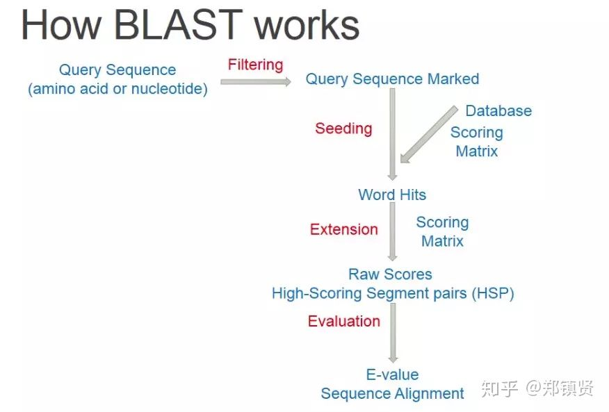
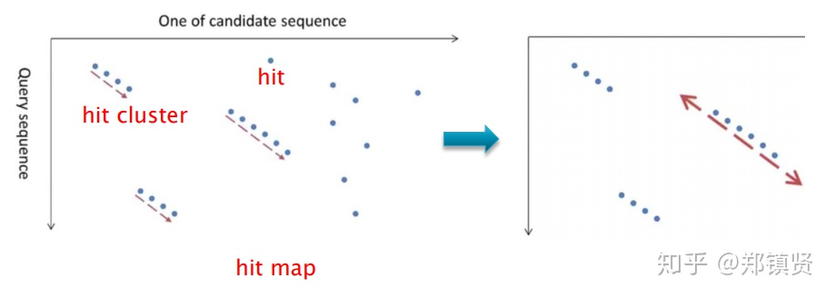
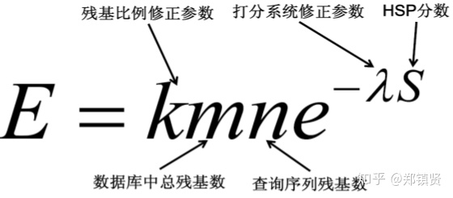

# 序列对比-Blast算法原理初探
    Basic Local Aligment Search Tool
    差不多局部比对工具

    1990， Altschul等人提出的双序列局部比对算法，作用于核酸、蛋白质。

已知一个包含若干序列的数据库(如:NCBI)，BLAST可以让研究者在其中寻找与其感兴趣的序列相同或类似的序列。

研究者利用BLAST来解决的其他问题有：

-   哪个细菌物种包含与氨基酸序列已知的某蛋白质有亲缘关系的蛋白质？

-   被测序的一段DNA来自哪里？

-   何种基因编码的蛋白质表现出刚刚被确定的某种结构或结构模体？

-   ……等等。

## 背景

BLAST使用`启发式搜索`来找出相关的序列，在速度上比完全只使用动态规划大约`快`上50倍左右，不过它不像动态规划能够保证搜索到的序列（Database sequence）和所要找的序列（Query sequence）之间的相关性，BLAST的工作就是尽可能找出数据库中和所要查询的序列相关的信息而已，`精确度稍微低一点`。此外，BLAST比FASTA更快速，因为BLAST只对比较少出现或是较重要的一些关键字作更进一步的分析，而FASTA是考虑所有共同出现在所要搜索的序列和目标序列的字。从下面介绍的算法可以更进一步的了解。

### blast 的基本流程
 
>知乎 @ 郑镇贤

#### Filttering(过滤)
    去除未知的序列中的多余信息。
    
#### Seeding
    拆分成多个短序列

#### Matching(比对)
    找相同，例如建立哈希树。

#### Extending(尝试着延长)

    将短序列、gap恰当的按照一定顺序延长

    想想矩阵呗。
当然这个得打个分
延伸的得分在下降的时候，我们就选择停止。
#### Evaluation(评估一下下)
    不怎么懂,黑人问号儿.jpg
    
>
The **lower** the E-value, or the closer it is to zero, the more **"significant"** the match is. However, keep in mind that virtually identical short alignments have relatively high E values. This is because the calculation of the E value takes into account the length of the query sequence. These high E values make sense because shorter sequences have a higher probability of occurring in the database purely by chance. For more details please see the calculations in the BLAST Course.
## *End*
    列出上一步骤中期望分数E低于我们所要求的门槛值之数据库序列。

### References
>[郑镇贤-从零开始生物信息学(4):序列比对-Blast算法简介](https://zhuanlan.zhihu.com/p/54294281)

>[NCBI blast操作指南](https://blast.ncbi.nlm.nih.gov/Blast.cgi?CMD=Web&PAGE_TYPE=BlastDocs)

>[Bioinformatics Sequence and Genome Analysis](http://www.bioinformaticsonline.org/)