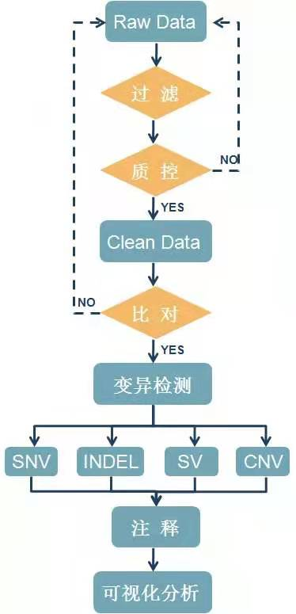

# 直播我的基因组学习笔记

## 我还能学.jpg
    正经点儿，一般的科研分析流程
    QC 、 alignment、 variation calling、annotation、statistic/visualization


    最后重头戏就是找variation了，跟参考基因组不一样的地方，
    
    包括snv、indel、cnv、sv，分别有自己适用的软件。
    
    我会比较多个软件的结果，尽量找到可信的variation，同时也会做基本的QC，
    严格的结合质量值、测序深度、重复性等因素进一步过滤筛选，过滤掉假阳性。
    
    但是跟参考基因组不一样的地方不一定就是有意义的，
    
    我还会根据一系列的数据库来注释找到variation。其中会利用到数据库数据主要有：

-   dbsnp147 （ncbi提供的最权威）
-   cgi69ExAC.vcf.gz（broadinstitute提供的外显子联盟）
-   Cosmic_v73.ann.vcf.gz （癌症突变信息集）
-   finalTCGA.vcf.gz （TCGA计划癌症相关）
-   1000g-ph3v5.gff.gz（千人基因组计划）
-   ESP6500（Variants from the Exome Sequencing Project (ESP)）
-   还有各个国家级的基因组计划的数据(SCLP,SSM,SSI,GONL,UK10K)
    三种主流注释软件我都会使用，包括VEP，ANNOVAR,snpEFF。

### 临床分析流程

-   重大疾病风险评估
-   先天性遗传疾病
-   个体化用药指导
-   您的遗传性状

### 全基因组重测序应该达到什么样的数据要求
    搜索一下就可以看到大部分公司宣传的全基因组测序都是30X，就是平均下来能把我们的30亿个碱基每个都测到30次，因为测序是随机的，必然有一些测序深度高一点，有些低一点。
    
    至于为什么选择30X这个标准呢，应该是有一篇文章做过梯度模拟，看看5~60X直接，对遗传变异的发现能力的增长情况如何，
    就是所谓的饱和度分析，而我们全基因组重测序的分析要点，就是挖掘跟参考基因组不一样的地方，而测序深度的增长伴随的就是成本的增长，
    
    表明“平均深度达到30X的时候，可以覆盖基因组的95%”、“ This will lead to confident SNP scores and tolerates areas with somewhat lower coverage ”(有兴趣请回复“文献”查看全文)。所以，对我们来说，30X是最佳的选择，可以以最优的成本来挖掘到足够的遗传变异。但是测序仪产出的数据是有质量好坏的，所以还需要跟测序公司约定测序数据里面质量标准，一般用Q20，Q30的百分比这样的指标来表示。而且一般成熟的测序公司都会有相应的数据分析工程师，有成型的数据处理流程，根据支付费用的多少可以选择不同的服务。
>根据文献`(Sequencing depth and coverage: key considerations in genomic analyses - Nature Reviews (2014))`

>`illumina`的解释（Sequencing Coverage Calculation Methods for Human Whole-Genome Sequencing；Calling Sequencing SNPs）


## 计算资源的查看
    cat /proc/cpuinfo |grep process |wc -l  
    free -g
    df -h

分别查看 core,memory,storage，请自行保证至少要有8core+16G+1T
    咱家大概的配置是:40、125g、3.6T

## 常用软件的下载
### bowtie
    ## Download and install bowtie
    cd ~/biosoft
    mkdir bowtie &&  cd bowtie
    wget  https://sourceforge.net/projects/bowtie-bio/files/bowtie2/2.2.9/bowtie2-2.2.9-linux-x86_64.zip

    #Length: 27073243 (26M) [application/octet-stream]
    #Saving to: "download"  
    ## I made a mistake here for downloading the bowtie2
    mv download   bowtie2-2.2.9-linux-x86_64.zip
    unzip   bowtie2-2.2.9-linux-x86_64.zip

### BWA
    ## Download and install BWA
    cd ~/biosoft
    mkdir bwa &&  cd bwa
    #http://sourceforge.net/projects/bio-bwa/files/
    wget  https://sourceforge.net/projects/bio-bwa/files/bwa-0.7.15.tar.bz2
    tar xvfj  bwa-0.7.15.tar.bz2  
    # x extracts, v is verbose (details of what it is doing), f skips prompting for each individual file, and j tells it to unzip .bz2 files

    cd bwa-0.7.15
    #export PATH=$PATH:/path/to/bwa-0.7.12 # Add bwa to your PATH by editing ~/.bashrc file (or .bash_profile or .profile file)

    # /path/to/ is an placeholder. Replace with real path to BWA on your machine

    #source ~/.bashrc

### hisat
    ## Download and install hisat
    cd ~/biosoft
    mkdir hisat &&  cd hisat
    nohup wget ftp://ftp.ccb.jhu.edu/pub/infphilo/hisat2/downloads/hisat2-2.0.4-Linux_x86_64.zip
    unzip hisat2-2.0.4-Linux_x86_64.zip

## 下载文件

    对，就是这个网址
    nohup wget  -c -r -nd -np -k -L -p    ftp://biodisk.org/Release/KPGP/KPGP_Data_2018_Release_Candidate/WGS/KPGP-00001 1>/dev/null   2>&1 & 


    ftp://biodisk.org/Release/KPGP/KPGP_Data_2018_Release_Candidate/KPGP-00001

    wget   -P /fafu/jiangxiaojiao ftp://biodisk.org/Release/KPGP/KPGP_Data_2018_Release_Candidate/KPGP-00001
                ftp://biodisk.org/Release/KPGP/KPGP_Data_2018_Release_Candidate/
    它们家的网站
-   网址为:http://opengenome.net/Main_Page#:~:text=Korean%20Personal%20Genome%20Project%20(KPGP,purpose%20of%20improving%20human%20health.

### 一般大型的文件的下载需要将其md5文件一起下载，来检验下载的文件是否下载完全
```bash    
md5sum KPGP-00001_L1_R1.fq.gz >md5tmp1.txt

cat md5tmp1.txt

cat KPGP-00001_L1_R1.fq.gz.md5
```

## 基因数据库分析
    这个对新手来说，是一个很大的坑，
`hg19`、`GRCH37`、 `ensembl 75`这3种基因组版本应该是大家见得比较多的了，

    国际通用的人类参考基因组，其实他们储存的是同样的fasta序列，只是分别对应着
    三种国际生物信息学数据库资源收集存储单位，
`NCBI`，`UCSC`及`ENSEMBL`各自发布的基因组信息而已。
    
    有一些参考基因组比较小众，存储的序列也不一样，比如BGI做的炎黄基因组，还有DNA双螺旋结构提出者沃森（Watson）的基因组，还有2016年发表在nature上面的号称最完善的韩国人做的基因组。

## 参考基因组
    下载好的基因组需要构建索引，
    因为我们会比较`bowtie2`,`hisat2`和`bwa`这3个主流比对软件的区别，所以我们会构建所有的索引

### 基因组各种版本对应关系：
    http://www.bio-info-trainee.com/1469.html
### 以下是下载参考基因组及比对软件的代码
    
#### 下载hg19：
    cd ~/reference
    mkdir -p genome/hg19  && cd genome/hg19
    nohup wget  http://hgdownload.cse.ucsc.edu/goldenPath/hg19/bigZips/chromFa.tar.gz &
    tar zvfx 
    cat *.fa >  hg19.fa
    rm chr*.fa

#### 下载hg38：
    cd ~/reference
    mkdir -p genome/hg38  && cd genome/hg38
    nohup wget http://hgdownload.cse.ucsc.edu/goldenPath/hg38/bigZips/hg38.fa.gz  &

#### 下载的小鼠基因组：
    cd ~/reference
    mkdir -p  genome/mm10  && cd genome/mm10
    nohup wget  http://hgdownload.cse.ucsc.edu/goldenPath/mm10/bigZips/chromFa.tar.gz &
    tar zvfx  chromFa.tar.gz
    cat *.fa >  mm10.fa
    rm chr*.fa

## 对比软件   
#### bowtie软件建立索引文件
    cd ~/reference
    mkdir -p index/bowtie && cd index/bowtie

    nohup time ~/biosoft/bowtie/bowtie2-2.2.9/bowtie2-build  ~/reference/genome/hg19/hg19.fa  ~/reference/index/bowtie/hg19 1>hg19.bowtie_index.log 2>&1 &

    nohup time ~/biosoft/bowtie/bowtie2-2.2.9/bowtie2-build  ~/reference/genome/hg38/hg38.fa  ~/reference/index/bowtie/hg38 1>hg38.bowtie_index.log 2>&1 &

    nohup time ~/biosoft/bowtie/bowtie2-2.2.9/bowtie2-build  ~/reference/genome/mm10/mm10.fa  ~/reference/index/bowtie/mm10 1>mm10.bowtie_index.log 2>&1 &

#### bwa软件建立索引文件
    cd ~/reference
    mkdir -p index/bwa && cd index/bwa

    nohup time ~/biosoft/bwa/bwa-0.7.15/bwa index   -a bwtsw   -p ~/reference/index/bwa/hg19  ~/reference/genome/hg19/hg19.fa 1>hg19.bwa_index.log 2>&1   &

    nohup time ~/biosoft/bwa/bwa-0.7.15/bwa index   -a bwtsw   -p ~/reference/index/bwa/hg38  ~/reference/genome/hg38/hg38.fa 1>hg38.bwa_index.log 2>&1   &

    nohup time ~/biosoft/bwa/bwa-0.7.15/bwa index   -a bwtsw   -p ~/reference/index/bwa/mm10  ~/reference/genome/mm10/mm10.fa 1>mm10.bwa_index.log 2>&1   &

#### hisat软件建立索引文件
    cd ~/reference
    
    mkdir -p index/hisat && cd index/hisat
    nohup wget ftp://ftp.ccb.jhu.edu/pub/infphilo/hisat2/data/hg19.tar.gz  &

    nohup wget ftp://ftp.ccb.jhu.edu/pub/infphilo/hisat2/data/hg38.tar.gz  &
    nohup wget ftp://ftp.ccb.jhu.edu/pub/infphilo/hisat2/data/grcm38.tar.gz &
    tar zxvf  hg19.tar.gz
    tar zxvf  grcm38.tar.gz
    tar zxvf   hg38.tar.gz

    <!-- 报错，查询命令试试呗 -->

    tar zxvf  hg19.tar.gz

    hg19/
    hg19/genome.8.ht2
    hg19/genome.5.ht2

    gzip: stdin: unexpected end of file
    tar: Unexpected EOF in archive
    tar: Unexpected EOF in archive
    tar: Error is not recoverable: exiting now

